# Heidelberger Schloss

Rekonstruktion des Heidelberger Schlosses um 1619 als animierte 3D-Szene, in reinem Java (Swing) mit eigenem Software-Renderer, ohne Grafikkarte, ohne Bilddateien: Gelände, Fluss, Wald, Himmel, Schloss, Hortus Palatinus und Licht entstehen zur Laufzeit aus Code und Messwerten.

Das Projekt wächst in Phasen. Der aktuelle Stand steht im *Heidelberg Werkbuch* (Artefakt), die Entscheidungen und Quellen dort im Protokoll.

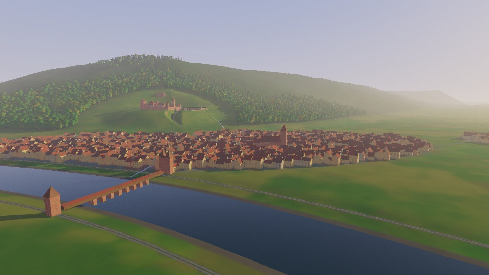

## Stand

| Phase | Inhalt | Stand |
|------:|--------|-------|
| 0 | Konzept, 15 Entscheidungen | fertig |
| 1 | Fundament: Himmel, Sonne und Mond, Neckartal, Fluss, Hang, Wald, Altstadt, Alte Brücke, Fenster und Bedienfeld | fertig |
| **2** | **Engine: Lichtstrahlen durch Fenster, spiegelnder Marmor, ruhige Becken mit Ringwellen, Probesaal und Probebecken** | **fertig** |
| **3** | **Schloss um 1619: Prunkbauten voll, übrige Bauten mittel, Türme und Mauern einfach, Dächer, Buntsandstein, Hof mit Pflaster** | **fertig** |
| **4** | **Hortus Palatinus: Terrassen, Pyramidentreppe, Knotenfelder, Bogenbau, Große und Kleine Grotte, Becken, Pomeranzenbäume, Elisabethentor** | **fertig** |
| **5** | **Wasser: Fontänen mit Ringwellen und Gischt, Kaskade der Großen Grotte, nasse Flächen, Neckar mit Strömung und Treibgut** | **fertig** |
| **6** | **Dampf und Licht: Talnebel mit Auflösung durch die Sonne, Gischtnebel, Rauch, Abendrot, Nacht mit Fackeln und Fensterlicht, Regenbogen in der Gischt, Schnee** | **fertig** |
| **7** | **Kamera und Regie: Kollisionsschutz, Flüge um Hindernisse herum, Rundumblick, Anflug, Orbit, Hortus-Überflug, Rundgang durch Tor und Hof, Zoom bis zu den Wappen, Drehbuch „Ein Tag auf dem Jettenbühl“ mit Tafeln und Quellen** | **fertig** |
| **8** | **Innenräume und Leben: Fassbau mit dem Großen Fass, Gläserner Saalbau mit Möbeln, Spiegeln und Kronleuchtern, Große Grotte mit Laternen, Kerzenlicht; Hofstaat, Wachen, Küfer, Reiter, Kutsche, Fasskarren, Vögel; Fahrt vom Hof in den Fassbau ohne Schnitt** | **fertig** |
| **9** | **Zugaben: Zeitschalter 1619 / 1689 / 1693 / 1764 mit Zeitraffer der Zerstörung (Feuer, Rauch, Sprengung, Gewitter), Wasserweg vom Hang zum Neckar, Wasserorgel mit Klang, Schnitt durch Terrassen und Bogenbau, Stein-Lupe mit Atommodell** | **fertig** |
| **10** | **Oberfläche und Datenbank: Startbild, Zustand beim Beenden und Wiederherstellen, Protokoll der Sitzungen, `HEI_`-Tabellen im Schema DEMO mit Skripten und Einrichter, Katalog der Quellen und Bauwerke** | **fertig** (Einrichter auf dem Zielrechner gelaufen, alles in Ordnung) |
| **11** | **Schliff: Programmsymbol mit Windows-Verknüpfung, schnellere Eckenumrechnung, zwei neue Farbstile, Randabdunklung im Kinomodus, Abgleich der gesicherten Punkte mit den Karten (Gipfelhöhen, Lage), Altstadtdächer, Felsflecken, Herbstlaub** | **geliefert** (Statusleiste bei dir steht aus) |

## Phase 2: Licht und Wasser

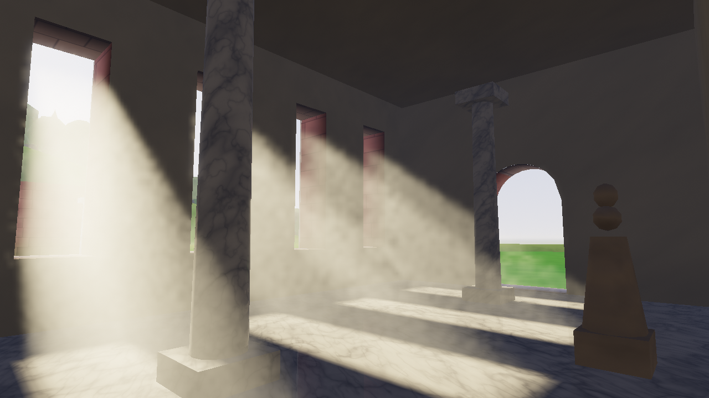

- **Lichtstrahlen durch Fenster**: Säle tragen eine Staubluft-Box; die Strahlen werden gegen die Schattenkarte gemarcht (feine Karte mit 12 cm Texel um den Schlosshof) und erscheinen als Lichtschächte mit Vorwärtsstreuung. Die Fenster haben echte Öffnungen mit Laibung, Rahmen und Sprossen.
- **Marmor** mit Adern und Glanz, **Glas** mit Spiegelung, beides über Bildschirmspiegelung (SSR).
- **Ruhige Becken** mit Fresnel, Spiegelung des Himmels und der Wände, Kaustik am Boden und Ringwellen, wo etwas hineinfällt.
- Der **Prüfstand** (`-Dheidelberg.probe=true`, oder `StillRender <ordner> probe`) zeigt nur einen Saal und ein Becken.

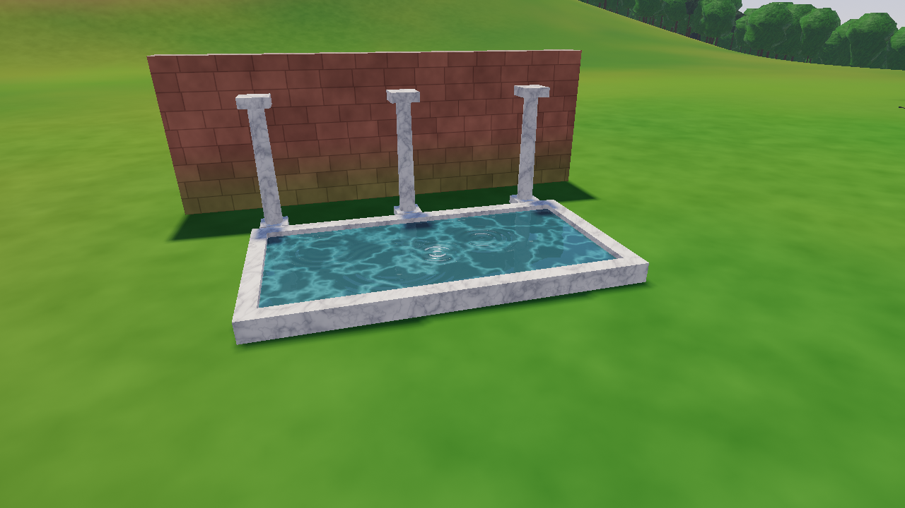

## Phase 3: Schloss

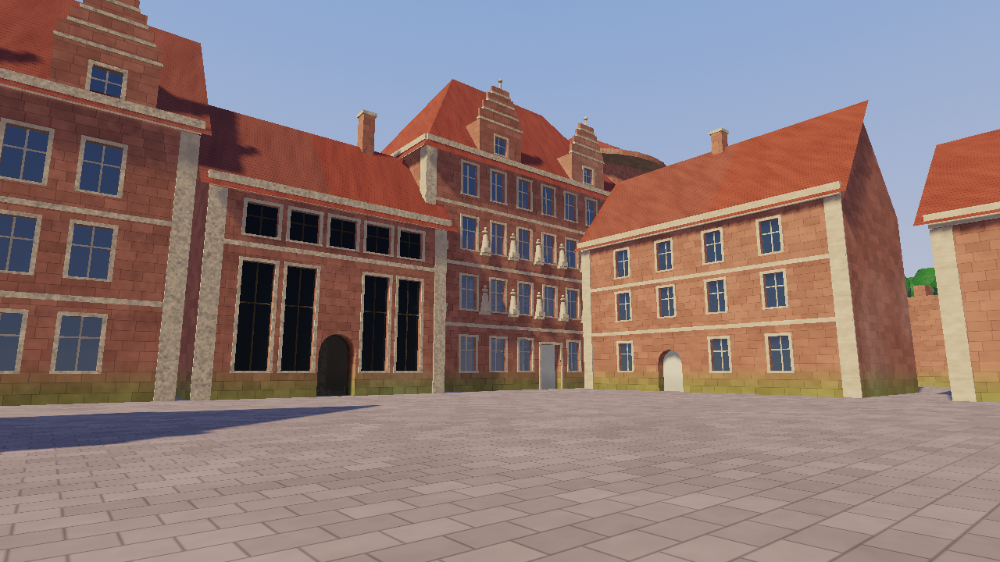

Gebaut aus einem Fassadenbaukasten (`com.dan.heidelberg.castle.Arch`): Öffnungen in einem Raster, Laibungen, Bögen, Gesimse, Glas, Sprossen, Giebel, Satteldächer und Walmdächer, Zinnen, runde Türme. Prunkbauten sind voll ausgearbeitet:

- **Ottheinrichsbau** (Renaissance-Fassade), **Friedrichsbau** mit 16 Standbildern und Zwerchgiebeln
- **Gläserner Saalbau** und **Fassbau** innen hohl, mit Staubluft für Lichtschächte (Blickpunkt „Gläserner Saalbau innen“, über G oder das Feld im Bedienfeld)
- Ruprechtsbau, Frauenzimmerbau, Englischer Bau, Bibliotheksbau, Ludwigsbau, Torturm mit Torhalle, Glockenturm, Apothekerturm, Dicker Turm, Krautturm, Brunnenhalle und die Ringmauer

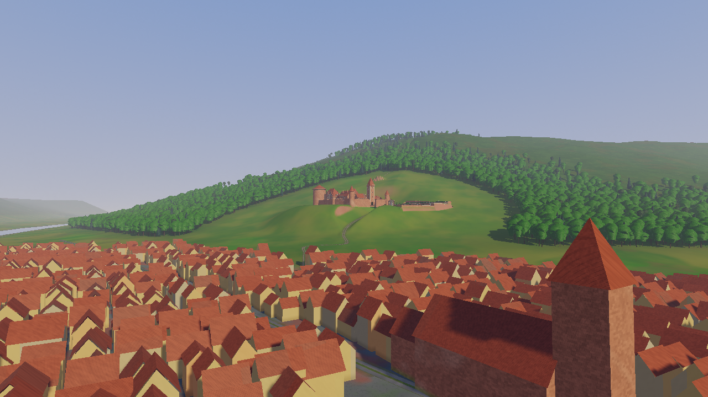

## Phase 4: Hortus Palatinus

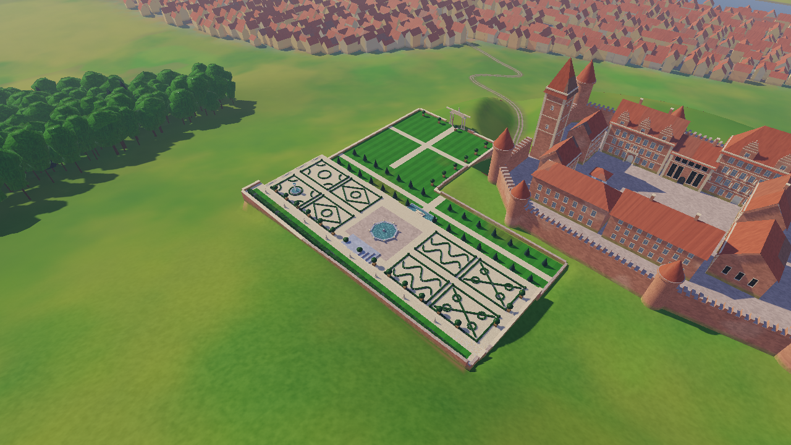

Drei Ebenen (Küchen-, Mittel- und Obere Terrasse) mit Stützmauern, **Bogenbau** mit Nischen, **Große** und **Kleine Grotte** (begehbar, mit Kaskade und Steintisch), Knotenfelder mit Buchsbandbeeten, Achteckbecken, Rhenus-Becken, Pomeranzenbäume in Kästen, Koniferen und Elisabethentor. Was de Caus nur plante und nie baute (Pyramidentreppe, Achteckbecken, Rhenus-Becken), ist als Material `PLANNED` markiert und lässt sich im Bedienfeld unter *Schloss und Hortus* bläulich tönen.

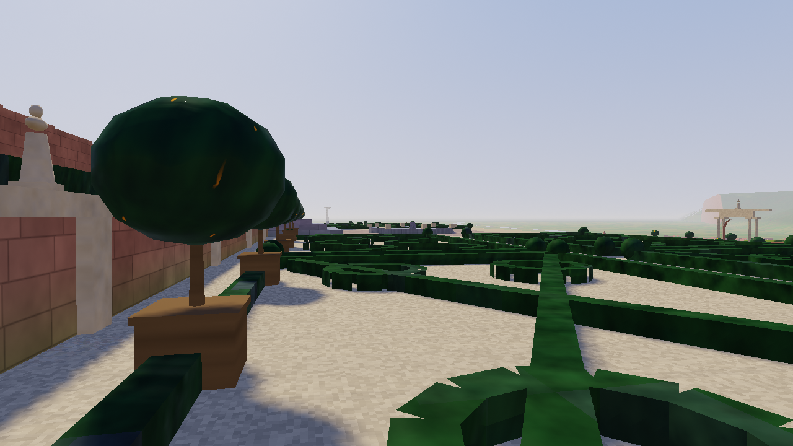
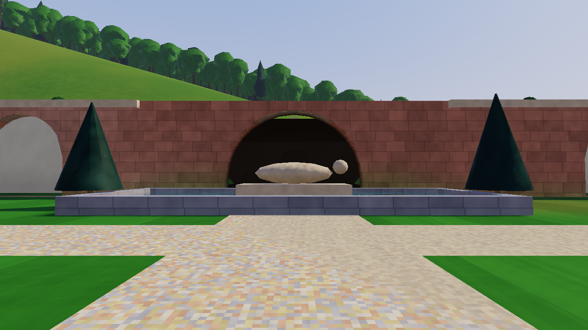

## Phase 5: Wasser

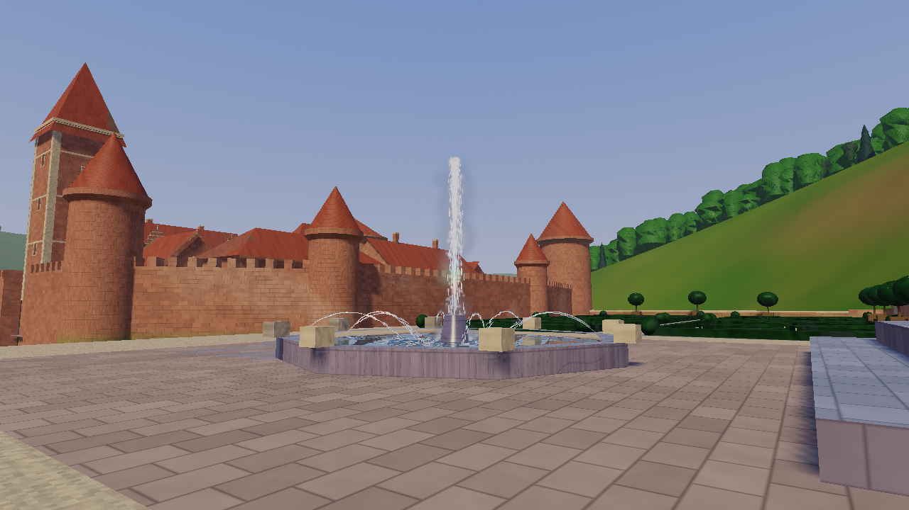

Jede Fontäne ist ein eigener Strahl in `com.dan.heidelberg.castle.Fountains`. Die Austrittsgeschwindigkeit wird mit demselben Integrator ausgerechnet, den auch das Teilchensystem benutzt (fester Schritt 1/60 s, Luftwiderstand, Schwerkraft). Dadurch erreicht jeder Strahl genau seine gewünschte Höhe oder Wurfweite.

| Brunnen | Strahlen |
|---|---|
| Achteckbecken | Mittelstrahl 5,5 m, acht Fratzen-Bögen (je 3,3 m weit) |
| Säulenbrunnen | Sprudel 1,6 m, dazu ein Schleier von der oberen Schale |
| Rhenusbecken | Krug-Bogen 1,9 m, vier Eck-Sprudel 0,9 m |
| Große Grotte | Kaskade aus drei Stufen, Springbrunnen 1,8 m |
| Kleine Grotte | Maul-Bogen 1,7 m und Überlauf |

- Fallende Tropfen erzeugen **Ringwellen** (bis 40 gleichzeitig, 5 s Lebensdauer), **Spritzer** und **Gischt**.
- **Nasse Flächen**: Wo Wasser landet, werden Stein, Marmor, Kies und Statuen dunkler und glänzender; die Nässe trocknet wieder und läuft bergab.
- Brunnen laufen nur im Umkreis von 330 m um die Kamera.
- **Neckar**: Strömung, Schaum und Treibgut (Laub, Äste) stammen aus dem Paket `com.dan.river`; die Dichte des Treibguts wurde erhöht.
- Im Bedienfeld unter *Wasser und Brunnen*: Brunnen ein/aus und Tropfendichte von 10 bis 800 %.

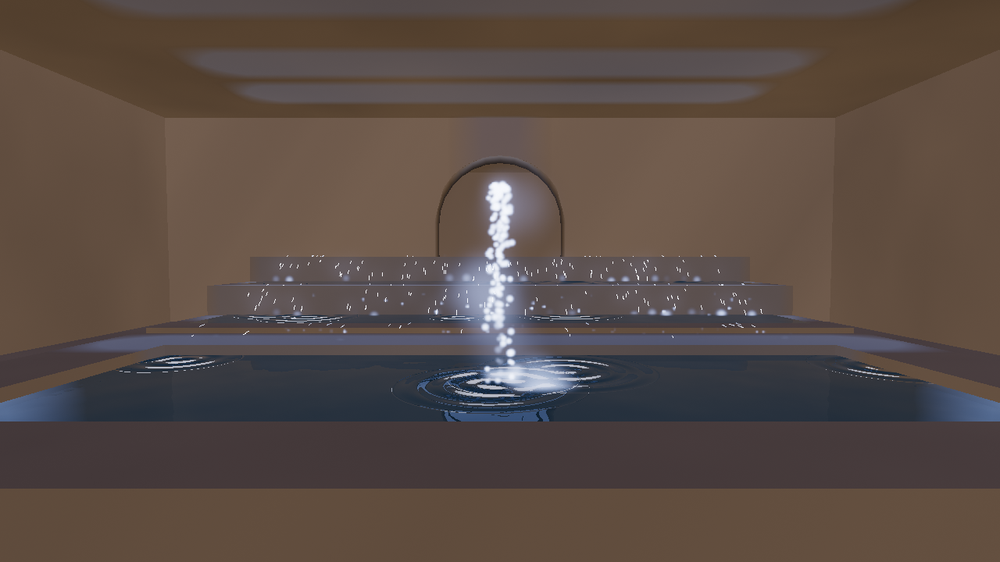
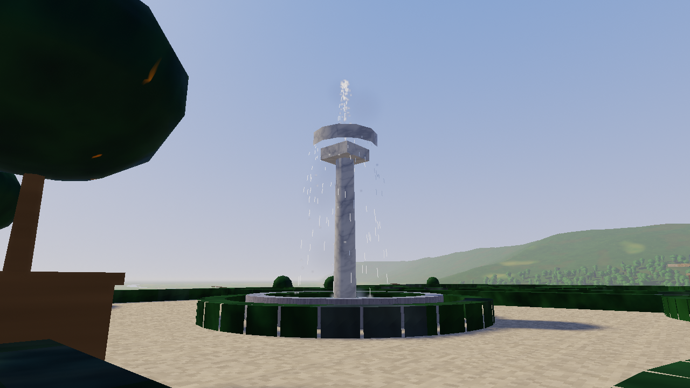
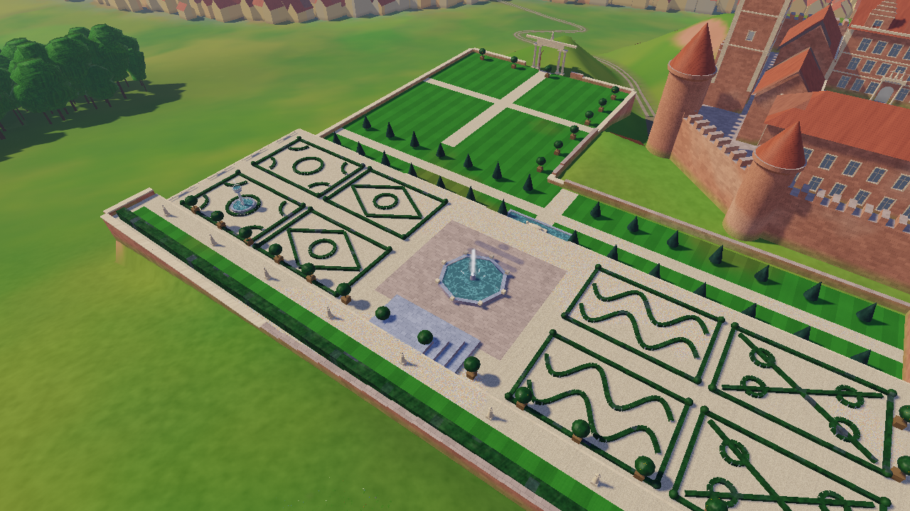

Gemessen auf dem Testrechner (2 Kerne, ohne Grafikkarte, `WaterCheck`):

| Prüfung | Ergebnis |
|---|---|
| Höhe Achteck-Mittelstrahl | Soll 5,50 m, gemessen 5,59 m |
| Höhe Säulenbrunnen | Soll 1,60 m, gemessen 1,63 m |
| Höhe Grotten-Springbrunnen | Soll 1,80 m, gemessen 1,83 m |
| Mittelstrahl bei 4 m/s Wind | Scheitel 5,55 m |
| Last | 25 680 Teilchen: Rechenschritt 1,6 ms, Bildzeit ohne messbaren Unterschied zu 0 Teilchen |

**Nicht gebaut**: ein eigener Abflussbach ins Tal (das Wasser läuft nur als Nässe bergab).

## Phase 6: Dampf und Licht

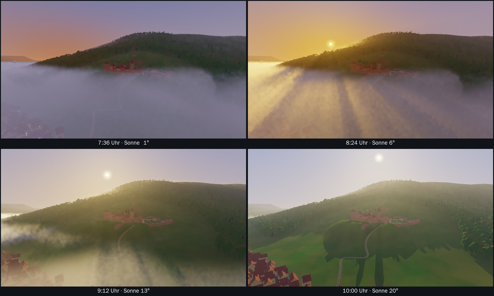

*12. Oktober, Blick vom Talboden zum Schloss: 7:36, 8:24, 9:12 und 10:00 Uhr.*

**Talnebel** (`effects/ValleyFog`, in `Engine3D.valleyFog`): Eine Nebelbank mit unruhiger Oberkante füllt das Neckartal. Ob ein Tag Nebeltag ist, wird je Monat und Tag gewürfelt (Wahrscheinlichkeit von 6 % im Juli bis 60 % im Oktober; 102 von 365 Tagen im Modelljahr). Der Nebel baut sich ab etwa 19:30 Uhr auf und löst sich auf, sobald die Sonne höher steigt: Mit der Sonnenhöhe sinkt die Oberkante, in der Bank wachsen Löcher. Wind, Regen und Bewölkung verkürzen ihn. Im Bedienfeld lässt sich ein Nebeltag erzwingen und die Dichte von 0 bis 200 % regeln.

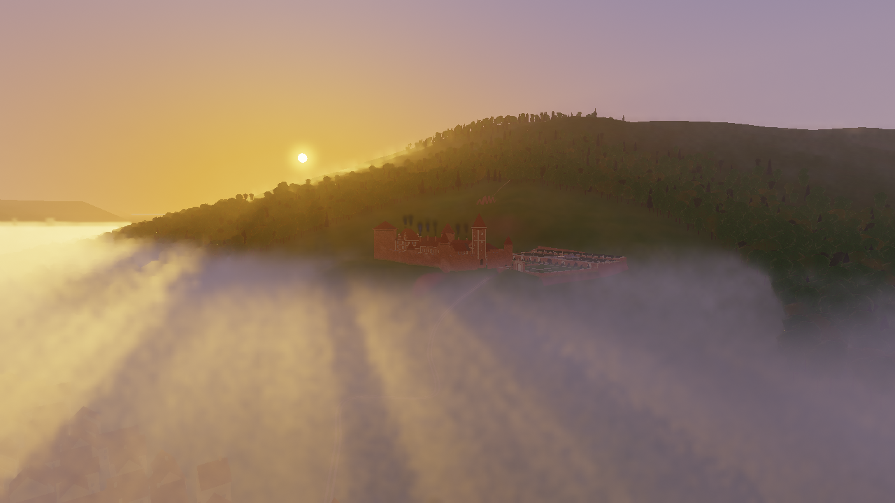
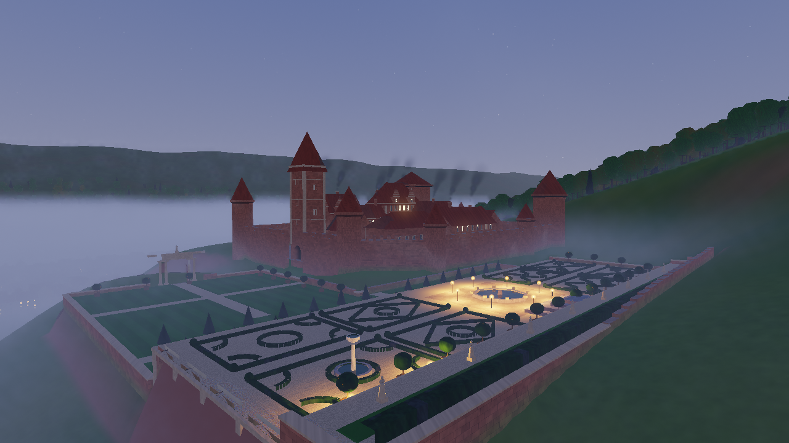

**Gischtnebel**: Die Fontänen füllen kleine Wasserdunstwolken in den Strahlenmarsch (`Fountains.sprays`). Sie streuen mit eigener Phasenfunktion und leuchten im Gegenlicht.

**Rauch** (`castle/Smoke`): Die acht Schornsteine des Schlosses und bis zu 70 der nächsten Altstadtschornsteine (649 im Stadtmodell, an etwa 30 % der Häuser) rauchen; je kälter die Luft, desto mehr. Der Rauch steigt, kühlt ab und driftet mit dem Wind.

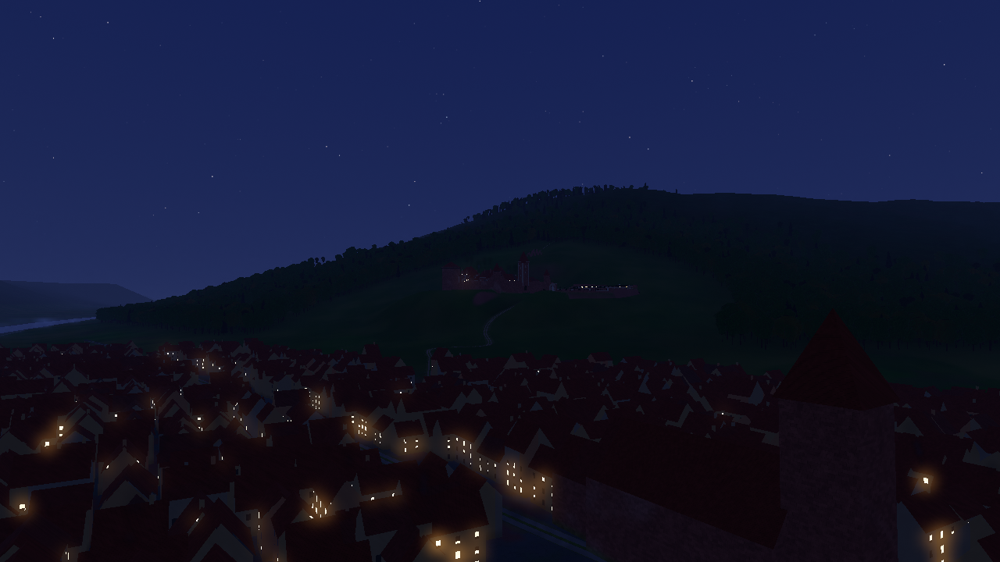

**Nacht und Fackeln** (`castle/Torches`): Holzpfosten mit Fackeln im Hof (6), am Achteckbecken (8), in der Großen Grotte (2) und am Säulenbrunnen (2). Bis zu 24 Fackeln im Umkreis von 160 m beleuchten ihre Umgebung als Punktlichter mit Flackern, dazu Flammen als leuchtende Sprites und dünner Rauch. Die Fenster der Altstadt und des Schlosses leuchten nachts, jedes Fenster mit eigener Zufallsentscheidung (neues Material `Mat.LIGHT`).

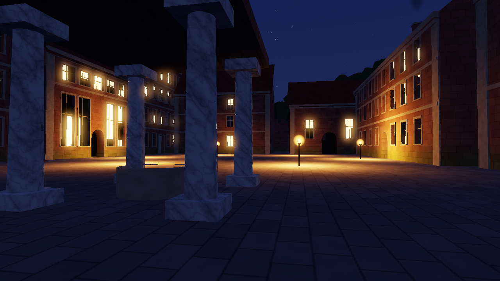
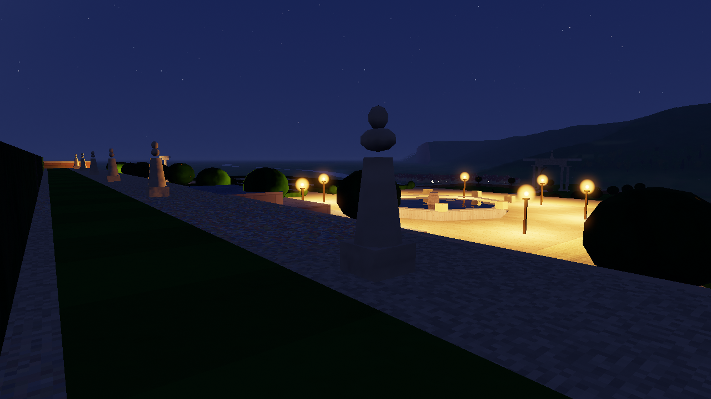

**Abendrot**: Die Himmelsstrahlung färbt sich bei tiefer Sonne gesättigt gold-orange (kein Aufhellen, sondern eine Farbverschiebung).

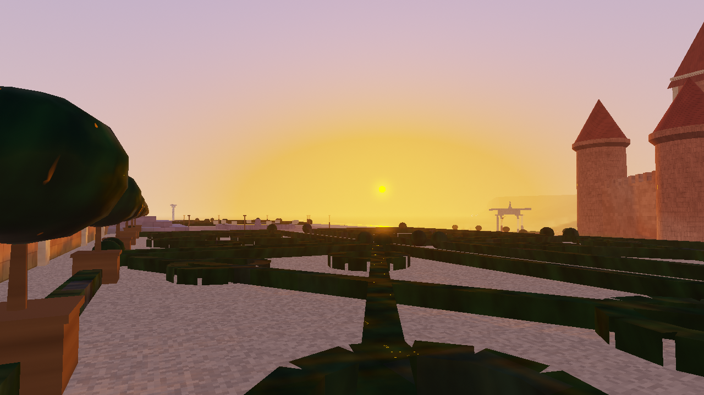

**Regenbogen in der Gischt**: Wasserdichte (Gischt und Schauerzelle) streut im Strahlenmarsch mit Regenbogenfaktor. Der Hauptbogen sitzt bei 42° um den Gegenpunkt der Sonne (rot außen), der Nebenbogen bei 51–53° mit umgekehrter Farbfolge. Die Schauerzelle ist eine optische Zelle gegenüber der Sonne, sie folgt der Kamera und ist kein echtes Wetter. Sie braucht eine Sonnenhöhe unter 42°.

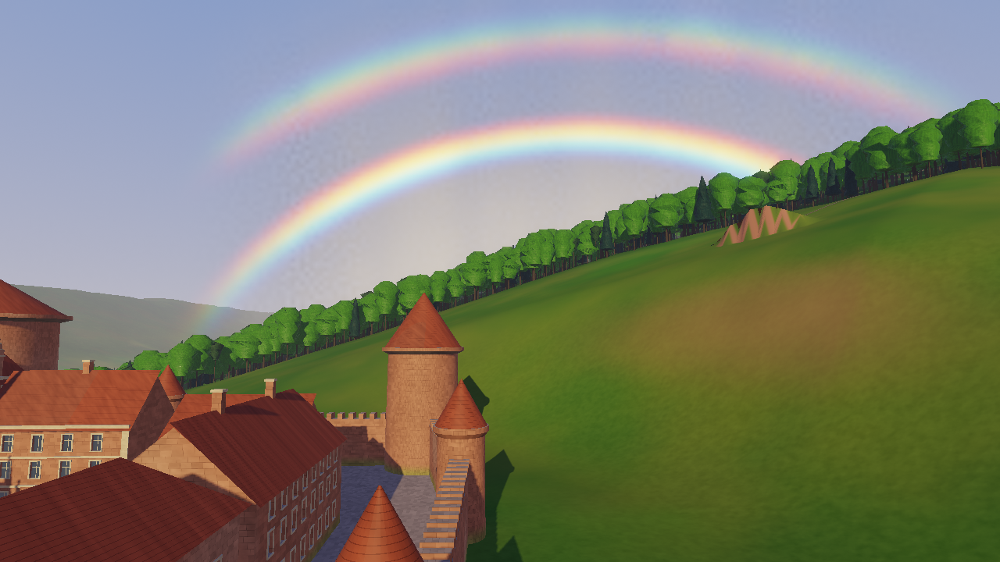
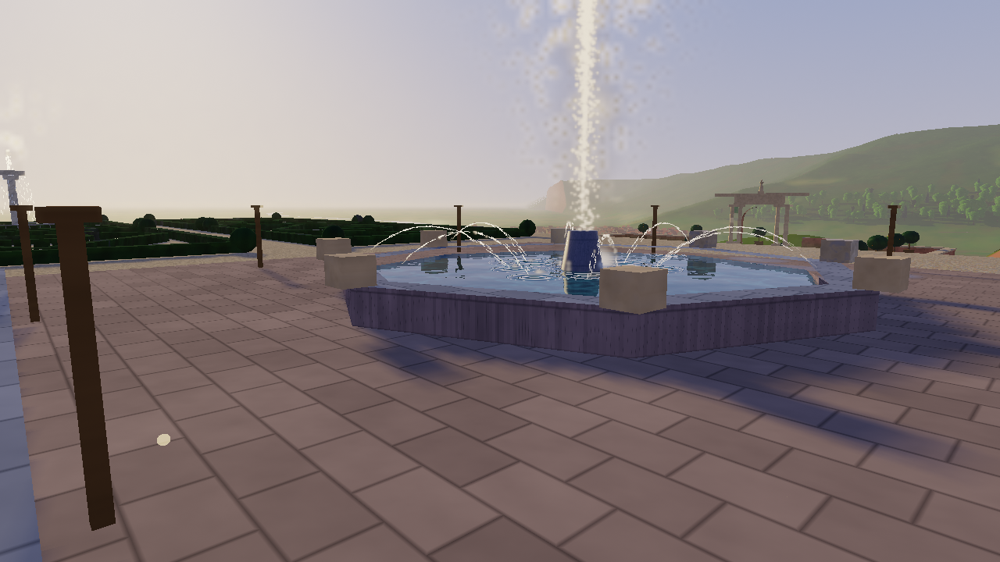

**Jahreszeiten**: Schnee deckt Dächer, Wiesen und Wege, wenn es schneit; er wächst mit der Schneefallzeit und schmilzt bei über 0,5 °C nach simulierten Stunden. Das Klimamodell allein erzeugt für Heidelberg keinen Schnee (die Monatsmittel liegen darüber), die Schneedecke kommt deshalb aus dem Schneefall oder aus der Stimmung „Schneefall über dem Schloss“.

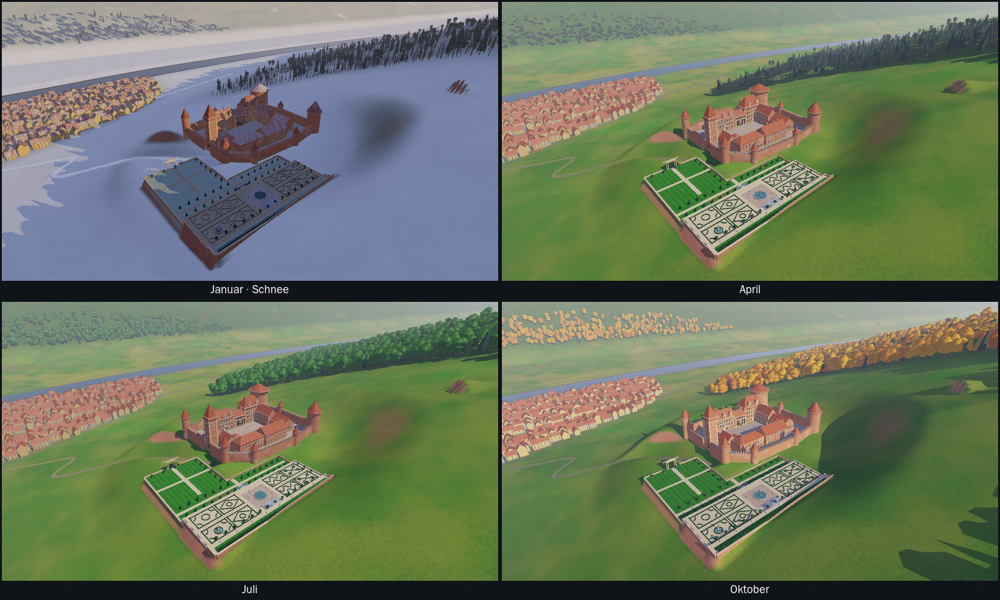

### Bedienung

Im Bedienfeld gibt es den Abschnitt **Dampf und Licht**: eine Stimmungsauswahl (Morgennebel über dem Tal, Nebel löst sich auf (Zeitraffer), Abendrot über der Rheinebene, Fackelnacht im Schlosshof, Fackeln im Hortus, Regenbogen nach dem Schauer, Rauch über der Altstadt, Schneefall über dem Schloss), die Schalter *Nebeltag erzwingen*, *Rauch*, *Fackeln und Fensterlicht*, *Regenschauer mit Regenbogen* und den Regler *Talnebel*. Sechs neue Blickpunkte (jetzt 25): Schloss über dem Nebelmeer, Schlosshof bei Nacht, Hortus bei Nacht, Altstadt im Morgenrauch, Regenbogen über dem Schlossberg, Abendrot über der Rheinebene.

Für Tests lassen sich Tag, Stunde und Nebel beim Start vorgeben: `-Dheidelberg.day=285 -Dheidelberg.hour=7.6 -Dheidelberg.fog=true -Dheidelberg.shower=true`.

### Gemessen

Auf dem Testrechner (2 Kerne, ohne Grafikkarte, `AtmoCheck` und `StillRender`):

| Prüfung | Ergebnis |
|---|---|
| Sicht auf den Schlosshof vom Talboden, 12. Oktober | 7:00 30 %, 7:36 11 %, 8:24 18 %, 9:12 15 %, 9:36 70 %, ab 10:00 100 % |
| Regenbogen, roter Punkt | Soll 42,2°, gemessen 42,5° |
| Regenbogen, blauer Punkt | Soll 40,8°, gemessen 40,5° |
| Nebenbogen, rot | Soll 50,5°, gemessen 50,5° |
| Bildzeit Talnebel | 286 ms gegen 288 ms ohne Nebel |
| Bildzeit Hof bei Nacht (18 Fackellichter, Fensterlicht) | 461 ms gegen 492 ms (+6 %) |
| Bildzeit Regenschauer | 292 ms gegen 311 ms |
| Rauch | 1334 Teilchen im Hof, 1320 über der Altstadt |

**Bekannte Mängel** (Phase 11):
- Unter dem Schloss liegt eine eingeebnete Geländekuppe, die am Morgen große dunkle Schatten wirft; an steilen Flanken erscheinen braune Felsflecken auf Wiesen und im Schnee.
- Der Gischtstrahl des Achteck-Mittelstrahls wirkt wie eine dichte weiße Säule.
- Fackellicht wirft keine Schatten (nur Ausrichtung zur Fackel und Abfall mit der Entfernung); höchstens 24 Lichter im Umkreis von 160 m.
- Häufigkeit und Höhe der Nebeltage sind ein Modell, kein Messwert.
- Ein Abflussbach (seit Phase 5) fehlt weiterhin.

## Phase 7: Kamera und Regie

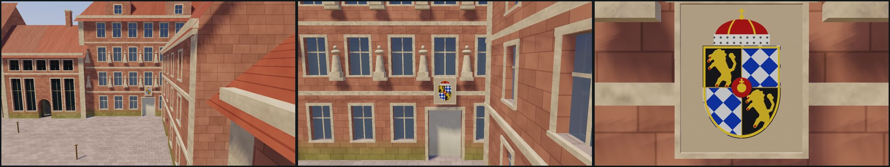

*Die Fahrt „Zoom zum Wappen am Friedrichsbau“: aus 40 m, 22 m, 11 m und 5 m Abstand, der Bildwinkel wird dabei von 55° auf 22° enger.*

Die Kamera geht jetzt nicht mehr durch Mauern, Gelände oder Bäume, weder bei Fahrten noch beim freien Bewegen. Darauf bauen zehn fertige Fahrten und ein Drehbuch auf.

### Kollisionsschutz

- **`core/Solids`**: Ein Gitter aus 8-m-Zellen über allen festen Dreiecken der Szene (Mauern, Dächer, Türme, Säulen, Pfosten, Stämme und Kronen; nicht Gelände, Wasser, Rasen, Hecken und Kies). 601 248 Dreiecke in 31 088 Zellen, Aufbau 0,2 bis 0,3 s. Fragen: Abstand, Hinausschieben, Strahl, freie Strecke, gleitende Bewegung.
- **`camera/CameraController`**: Auge (Radius 0,5 m) und Drehpunkt (0,4 m) bleiben aus festen Körpern heraus und gleiten an Wänden und Stämmen entlang. Zieht ein Schritt zwischen zwei Bildern durch eine Fläche, bleibt das Auge stehen. Jede Eingabe (Maus, Rad, Bewegungstasten) bricht eine Fahrt ab und übernimmt die Kamera dort, wo sie steht.
- **`camera/Router`**: Flüge zu einem Ziel (Blickpunkte, Fahrten) werden um Hindernisse herum geplant: erst gerade, dann über einen Fluchtweg im 1,2-m-Gitter, dann mit Bogen über das Schloss. Jeder Vorschlag wird entlang der wirklichen Kurve in 0,04-s-Schritten geprüft. Die Flugzeit wächst mit dem Logarithmus der Strecke (etwa 8 s für die längsten Flüge).
- **Torbrücke** (`Castle.torbruecke`): Vor dem Torturm liegt im Gelände ein Graben; eine Steinbrücke auf vier Pfeilern führt hinüber, damit der Rundgang auf festem Boden durchs Tor geht. Ihre Form ist angenommen.

### Wappen

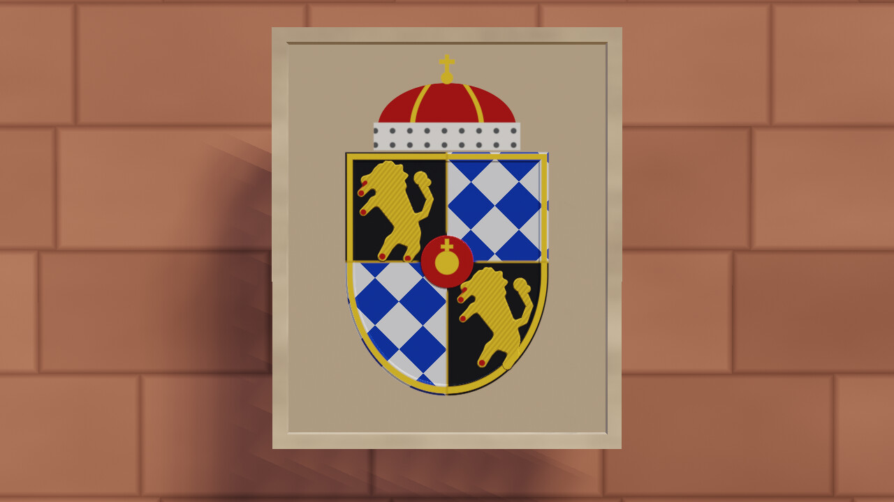

Drei Wappenplatten (`castle/Heraldry`, Material `Mat.HERALD`): am Friedrichsbau und am Ottheinrichsbau über dem Portal der Hofseite, am Torturm an der Außenseite. Das Wappen wird im Shader gemalt: geviert mit Pfälzer Löwe (Gold auf Schwarz) und bayerischen Rauten (Silber und Blau), Herzschild mit Reichsapfel und darüber der Kurhut. Das Relief entsteht aus dem Gefälle der Zeichnung (kein Bild, keine Textur). Der Löwe ist aus Kapseln und Kreisen zusammengesetzt, also **stilisiert**; Ort und Größe der Platten sind angenommen.

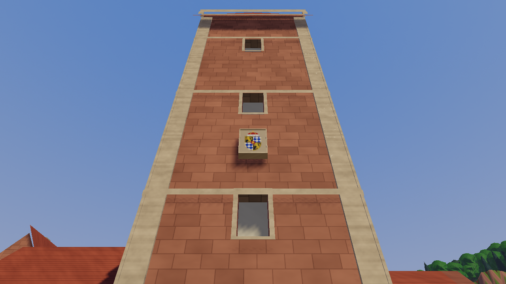

### Fahrten

Im Bedienfeld unter **Kamera und Regie** (Taste V schaltet zur nächsten):

| Fahrt | Dauer | Inhalt |
|---|---:|---|
| Rundumblick im Schlosshof | 54 s | voller Kreis, Auge im Hof |
| Rundumblick vom Hortus | 54 s | voller Kreis von der Hauptterrasse |
| Rundumblick vom Königstuhl | 60 s | voller Kreis vom Gipfel, 45 m über dem Boden, damit die Baumkronen den Blick freigeben |
| Anflug auf das Schloss | 36 s | vom Neckar über den Torturm hinab in den Hof |
| Orbit um das Schloss | 70 s | hoher Kreis um die ganze Anlage |
| Überflug des Hortus | 25 s | tief über Terrassen, Becken und Säulenbrunnen |
| Rundgang durch Tor und Hof | 50 s | zu Fuß (Augenhöhe 1,75 m) von der Torbrücke durch den Torturm, über den Hof bis in den Gläsernen Saalbau |
| Zoom zum Wappen am Ottheinrichsbau, Friedrichsbau, Torturm | je 16,5 s | Annäherung auf 5 m, Bildwinkel 55° auf 22° |

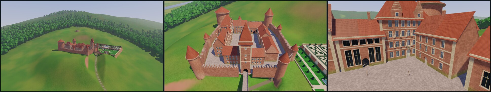
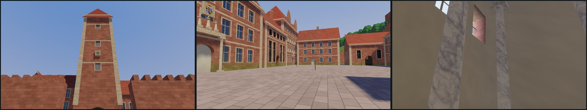
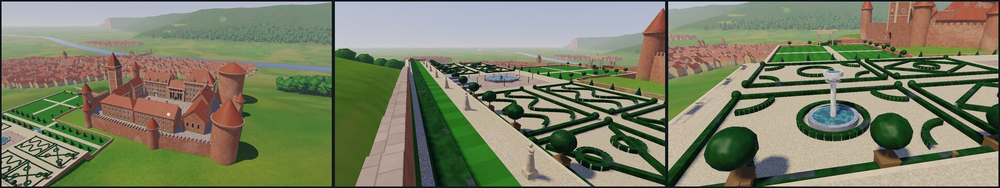
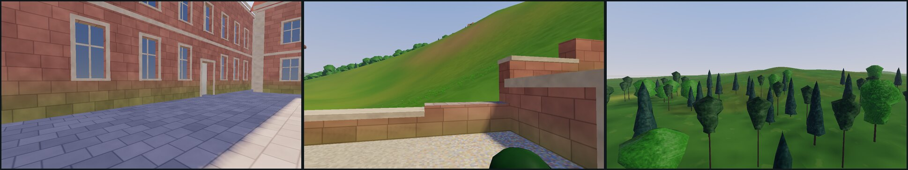

Jede Fahrt fliegt zuerst von der jetzigen Stelle an ihren Anfang (Router), mit gleitendem Bildwinkel. Das Tempo (0,5 bis 2 ×) stellt das Bedienfeld ein.

### Drehbuch „Ein Tag auf dem Jettenbühl“

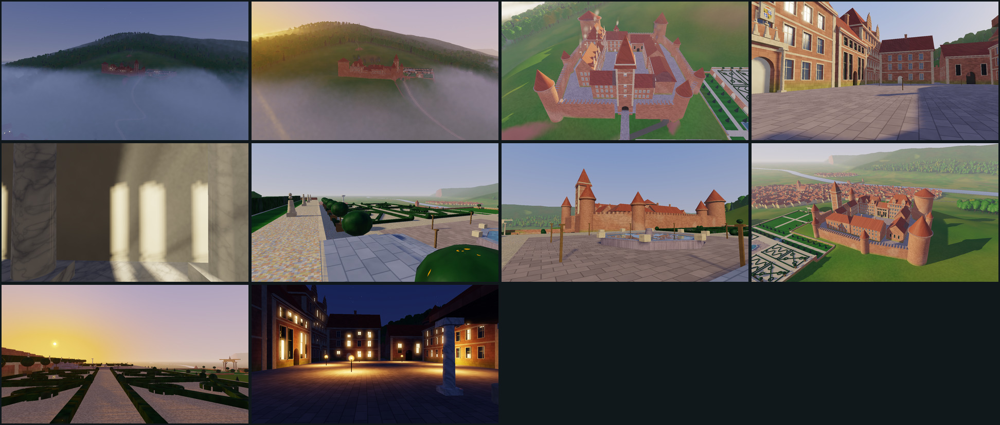

Zehn Szenen, gut sieben Minuten: Vor Sonnenaufgang, Sonnenaufgang, Der Torturm, Zu Fuß durch Tor und Hof, Mittag im Saal, Der Hortus Palatinus, Das Achteckbecken, Das Schloss von oben, Abendrot, Fackelnacht und Mond. Die Regie (`camera/Director`) schaltet Uhrzeit (6:36 bis 20:36 am 12. Oktober), Talnebel, Dunst und Fackeln; die Kamerafahrten kommen aus `Rides`. Zu jeder Szene gehören Tafeln unten links mit Kopf, Text und Quelle.

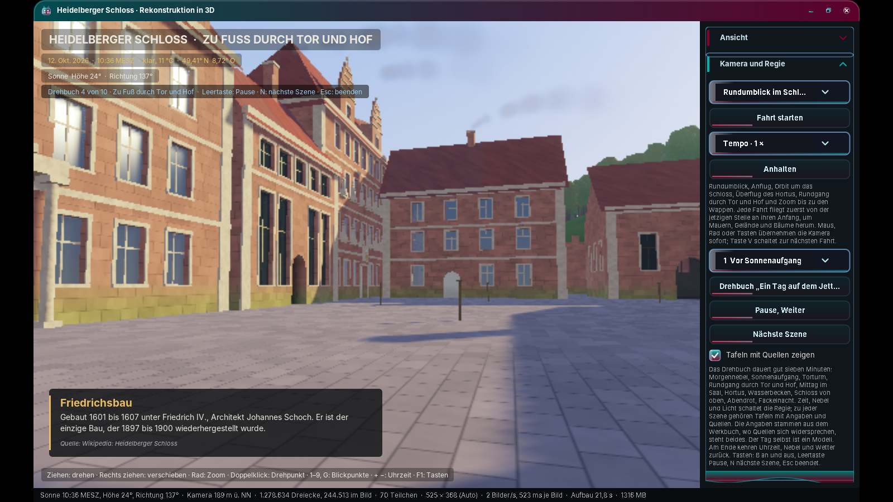

- Alle Angaben auf den Tafeln stehen im Werkbuch und sind dort nachgeschlagen (Wikipedia: Heidelberger Schloss, Heidelberg Castle, Hortus Palatinus deutsch und englisch, Heidelberg; Staatliche Schlösser und Gärten Baden-Württemberg). Wo Quellen sich widersprechen (Ruprechtsbau um 1400 oder ca. 1430, Beginn des Hortus 1614 oder 1616, Zerstörung 1688 oder 2. März 1689), steht auf der Tafel beides.
- Was die Rekonstruktion annimmt (Wappen, Dachform des Torturms, Säulen im Saal, Strahlen der Brunnen) und was das Programm als Modell festlegt (Nebeltag, Sonnenstand), ist auf den Tafeln als *Annahme* oder *Modell* gekennzeichnet.
- Leertaste pausiert, N springt zur nächsten Szene, Esc oder jede Kamerabewegung beendet das Drehbuch. Danach kehren Uhrzeit, Nebel, Dunst und Wetter zurück.

### Bedienung

Neu: Abschnitt **Kamera und Regie** im Bedienfeld (Fahrtenliste, Fahrt starten, Tempo, Anhalten, Szenenliste, Drehbuch starten, Pause, Nächste Szene, Tafeln an und aus). Tasten: **V** nächste Fahrt, **B** Drehbuch an und aus, **N** nächste Szene, **Leertaste** Pause im Drehbuch, **Esc** beendet Fahrt oder Drehbuch (im Kinomodus danach der Kinomodus). Für Tests: `-Dheidelberg.script=3` startet das Drehbuch ab Szene 4, `-Dheidelberg.ride=8` die Fahrt Nr. 9.

### Gemessen

Auf dem Testrechner (2 Kerne, ohne Grafikkarte; `CameraCheck` und `DirectorCheck`, 25 Bilder/s simuliert):

| Prüfung | Ergebnis |
|---|---|
| 25 Blickpunkte, Auge und Drehpunkt | keiner in einem festen Körper |
| 600 Flüge (jeder Blickpunkt zu jedem anderen) | 0 Verstöße; kleinster Abstand zu Körpern 0,42 m, zum Boden 1,5 m; längster Flug 8,3 s |
| Freies Bewegen, 6 000 Bilder mit Zufallseingaben (Tasten, Maus, Rad) | 0 Bilder im Körper, 0 Schritte durch Flächen, 0 unter dem Boden; kleinster Abstand 0,40 m |
| 10 Fahrten | 0 Verstöße; kleinster Abstand zu Körpern beim Rundgang 0,58 m |
| Drehbuch, 421 s, 10 527 Bilder einschließlich der Anflüge zwischen den Szenen | 0 Bilder im Körper, 0 Schritte durch Flächen, 0 unter dem Boden, kleinster Abstand 0,58 m, keine Sprünge |
| Abbruch durch Mausruck, Pause, Überspringen | wie vorgesehen (Pause: 0,0000 m Bewegung) |

„Verstoß“ heißt: Auge näher als 0,25 m an einem festen Körper, weniger als 1 m über dem Boden oder eine Strecke zwischen zwei Bildern, die eine Fläche kreuzt.

**Bekannte Mängel und Grenzen**:
- Geprüft wird die Lage des Auges (Kugel von 0,5 m) und des Drehpunkts (0,4 m), nicht jeder Blick auf eine Fläche: Bei einer Wand dicht vor dem Auge sieht man ihre Innenseite nicht durch, aber ein Gegenstand kann den Blick verdecken. Gras, Blumen, Hecken, Wasser und fallende Blätter zählen nicht als fest.
- Der Löwe im Wappen ist stilisiert. Es gibt nur drei Wappen; Ort und Größe sind angenommen.
- Die Torbrücke ist angenommen; der Graben ist Teil des Geländes.
- Im Saal stehen nur Säulen, sonst nichts (Innenräume folgen in Phase 8).
- Die Tafeln stehen im Bild und werden nicht mitgerechnet, wenn ein Standbild gespeichert wird.
- Der Kollisionsschutz und die Fahrten sind auf dem Testrechner gemessen; ob das Drehbuch auf deinem Rechner mit 30 Bildern/s läuft, zeigt die Statuszeile.
- Die Phase-6-Mängel (eingeebnete Geländekuppe, Felsflecken, kein Abflussbach, keine Fackelschatten) bleiben.

## Phase 8: Innenräume und Leben

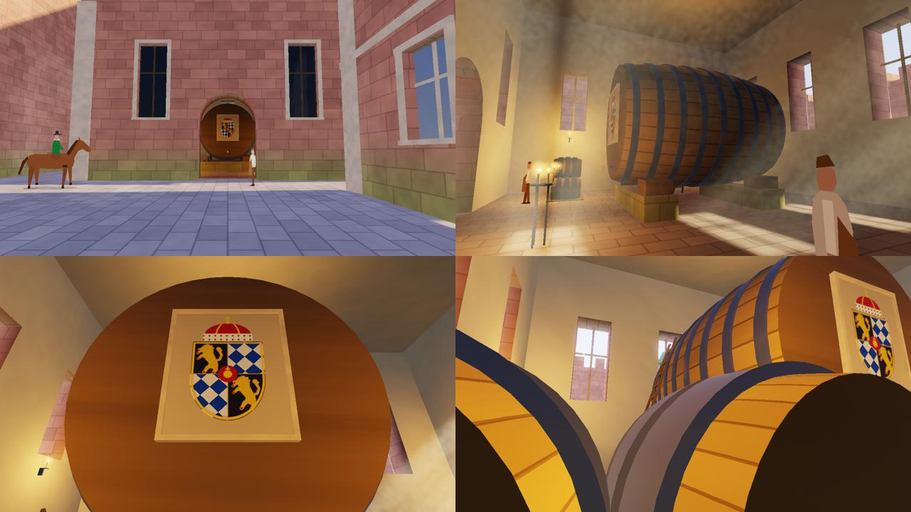

*Das Große Fass im Fassbau: von der Tür, von der Seite, der Boden mit dem Wappen der Kurpfalz, die Leiter.*

Die Räume haben jetzt Einrichtung und Kerzenlicht, und der Hof ist bewohnt. Fertig war die Phase, als die Kamera ohne Schnitt vom Hof in den Fassbau fuhr (`Rides.fassbau`, 31 s, 67 m).

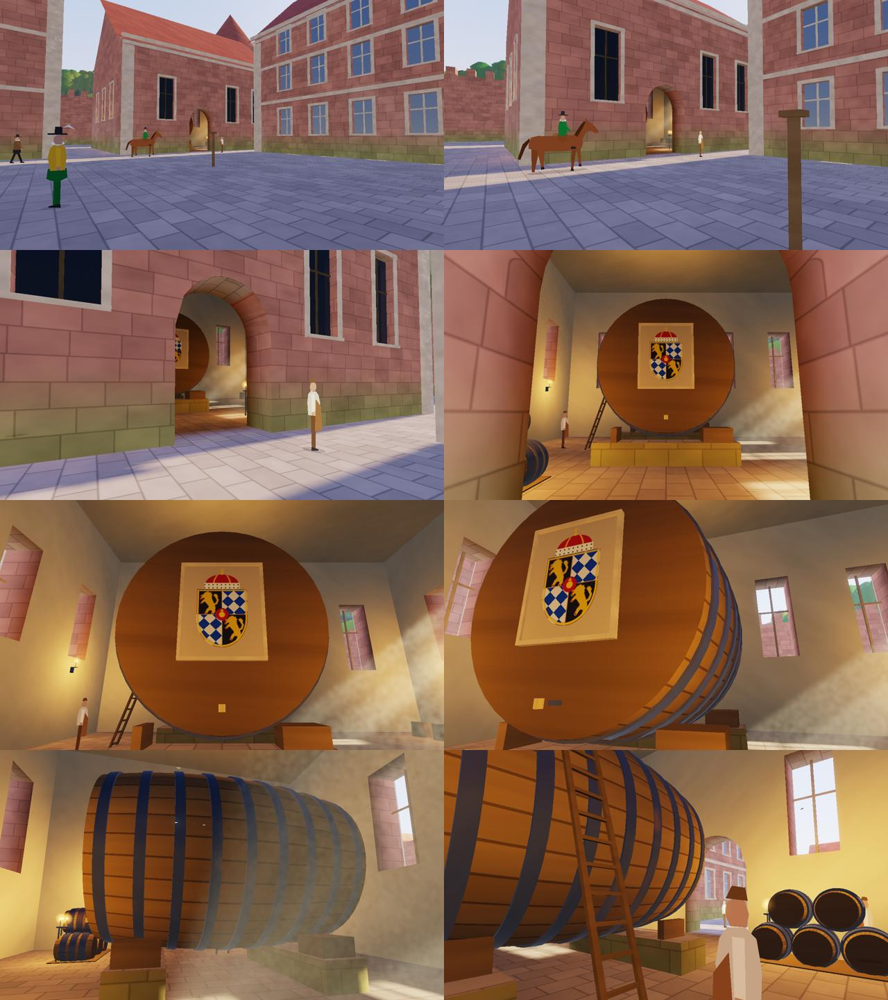

*„Vom Hof in den Fassbau“, ein einziger Flug: über den Hof, durch die Tür, vor den Fassboden, einmal um das Fass herum und zurück zur Tür.*

### Fassbau und Großes Fass

`castle/Interior.fass`: ein liegendes Fass aus 34 Dauben (Eiche, Material `Mat.OAK`, Daubenfugen und Maserung im Shader) mit neun Eisenreifen (`Mat.IRON`, mit Rost), 6,7 m lang und 5,1 m im Bauch, auf zwei Sandsteinsockeln mit Holzkeilen. Dazu ein Wappen der Kurpfalz am Fassboden, Zapfhahn, Spundloch, eine Leiter an der Nordflanke, fünf liegende Fässer, eine Küferbank, drei Bottiche, zwei Dreifüße mit Kerzen und Wandleuchter. Staub in der Luft macht die Sonnenstrahlen durch die Fenster sichtbar.

- **Gesichert**: Das erste Große Fass wurde 1589 bis 1591 unter Pfalzgraf Johann Casimir von Baumeister Michael Werner aus Landau gebaut und fasste rund 127 000 Liter (de.wikipedia; zum.de nennt 128 000). Im Dreißigjährigen Krieg wurde es zerstört.
- **Angenommen**: Maße (Länge und Bauch sind aus dem Fassungsvermögen skaliert, überliefert sind sie für das erste Fass nicht), das Wappen am Boden, die Leiter, Küfer und Bottiche. Ein Tanzboden auf dem Fass ist erst vom Fass von 1664 überliefert und deshalb **nicht** gebaut.

### Gläserner Saalbau

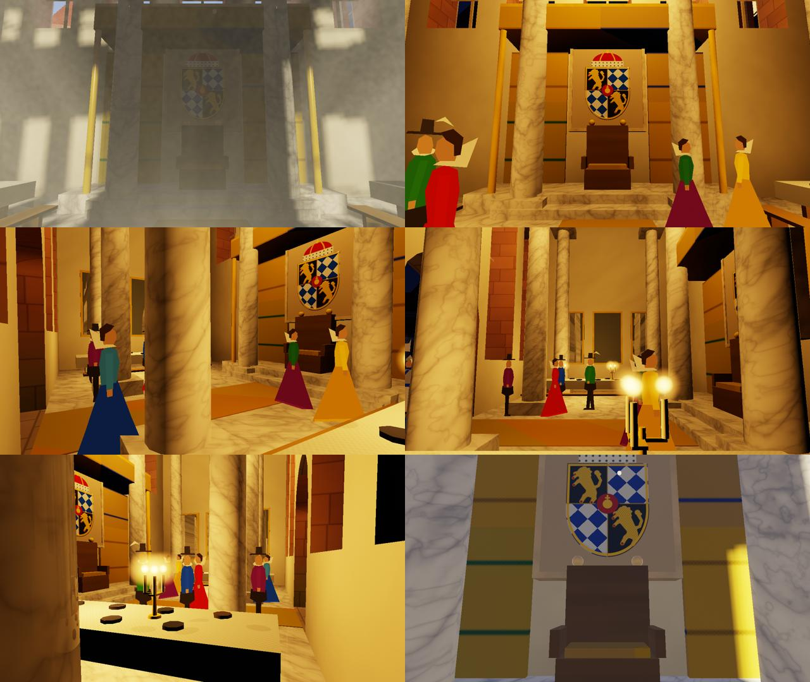

`castle/Interior.saal`: Teppich, Podest mit Thron, Baldachin und Vorhängen, Wappen an der Nordwand, zwei Tafeln mit Bänken und Kerzenleuchtern, sechs Wandspiegel mit Goldrahmen (Material `Mat.MIRROR`: dunkles venezianisches Glas mit starker Spiegelung des Himmels) und drei Kronleuchter mit je zwölf Kerzen. Die Mitte bleibt frei, damit der Rundgang bis zum Thron führt.

- **Gesichert**: Friedrich II. ließ den Bau 1544 bis 1556 errichten; der Saal lag im Obergeschoss und hatte venezianisches Glas. Das Dach brannte 1764 ab.
- **Angenommen**: Der Saal liegt hier **ebenerdig**, so wie schon in Phase 3, damit er erreichbar ist. Möbel, Spiegel, Kronleuchter und die Aufstellung der Säulen sind Annahmen.

### Kerzenlicht

`castle/Candles` verwaltet kleine Flammen (leuchtende Sprites mit Flackern) und Lichter in vier Gruppen; `castle/Torches.update` wählt aus allen Fackeln und Kerzen die nächsten 28 und gibt sie an den Bildrechner. Der Saal brennt, sobald es dämmert, Fassbau und Grotten immer. Kerzen werfen wie alle Punktlichter **keine Schatten**. Neue Materialien: `CLOTH` (Samt und Teppich), `LINEN`, `OAK`, `IRON`, `WAX`, `MIRROR`, `GOLD`.

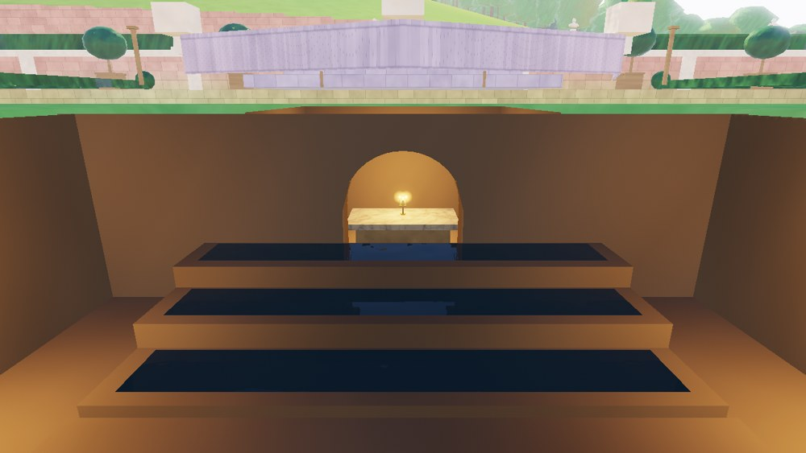

In der Großen Grotte hängen jetzt Laternen vor der Kaskade (`Interior.grotten`).

### Hofstaat und Wagen

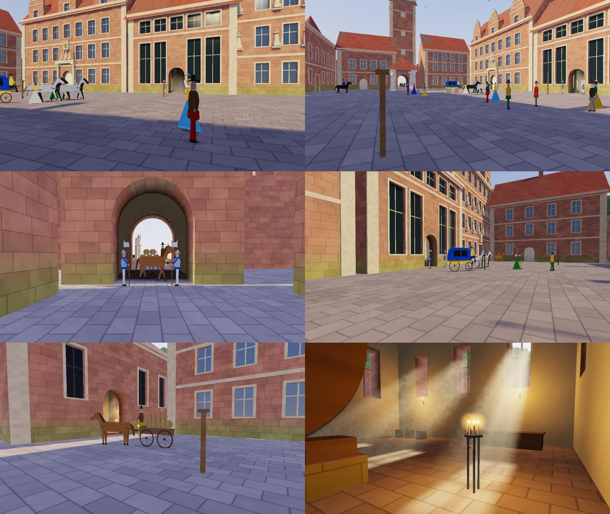

`castle/Life` lässt 46 Figuren auftreten, dazu eine Kutsche mit Vierergespann und einen Fasskarren mit Pferd. Alles ist eine **Funktion der Zeit**: Jede Figur geht auf einem festen Weg (Ring, abgerundetes Rechteck, Pendelstrecke), ihre Stelle ergibt sich aus Weglänge und Tempo, es gibt keinen gespeicherten Zustand. Ein Standbild und ein Film zeigen daher dasselbe.

| Gruppe | Zahl | Wann | Wo |
|---|---:|---|---|
| Herren, Damen und Diener | 21 | 7:30 bis 20:30, nicht bei Regen | Ringe um die Hofmitte, um die Brunnenhalle, Rundweg am Hofrand |
| Wachen mit Hellebarde | 8 | immer | am Tor, auf der Torbrücke, am Saalbau, zwei Streifen |
| Küfer | 5 | 6:30 bis 18:30 | vor und in dem Fassbau |
| Gäste und Kurfürst im Saal | 9 | ab 17:15 bis kurz nach Mitternacht | um Tische und Podest |
| Reiter | 3 | 8:30 bis 18 Uhr, nicht bei Regen | Rundweg am Hofrand im Trab |
| Kutsche mit vier Pferden | 1 | 8 bis 18:30 Uhr, alle 300 s | von der Torbrücke durch das Tor, Halt vor dem Saalbau (32 s), eine Runde, zurück |
| Fasskarren | 1 | 6:30 bis 18:30 Uhr, alle 210 s | durch das Tor zum Fassbau, Halt (14 s), Runde über den Hof |

Die Menschen sind **Schattenrisse** in der Technik der Tiere aus der Vorlage (`core/Animals`, `Engine3D.drawFigure`): Umrisse in Metern, gefüllt und nach Sonne, Himmel, Kerzen und Dunst beleuchtet, mit Schrittzyklus (Beine, Arme, Rocksaum), Schattenfleck und Tiefenprüfung. Ihre Ebene dreht sich so weit zur Kamera, dass sie nie zur Linie wird. Es gibt Herr (Hut, Halskrause, Wams, Kürbishose), Dame (Reifrock, Kragen, Haube), Wache (Morion, Brustharnisch, Hellebarde, Pfälzer Blau und Weiß), Küfer (Kappe, Schurz), Kurfürst (Umhang, Kette). Pferde laufen im Trab oder Schritt; Wagenräder drehen sich mit der gefahrenen Strecke. In Räumen sinkt das Umgebungslicht, die Kerzen leuchten die Figuren an.

Kleidung, Zahl, Wege und Tageszeiten sind **Annahmen**.

### Vögel

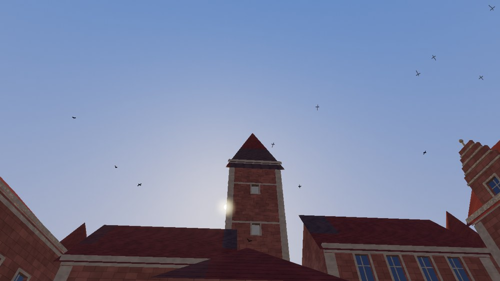

Vögel sind flatternde Winkel (`Sprites.BIRD`): neun Tauben in einem Schwarm über dem Hof, vier bis sieben Krähen (im Winter mehr), ein Mäusebussard hoch über dem Hang (tagsüber, kein Flügelschlag), im Sommer (Tag 108 bis 262) acht bis vierzehn Schwalben um die Türme, in der Dämmerung sechs Fledermäuse.

### Bedienung

Neuer Abschnitt **Räume und Leben** im Bedienfeld: Hofstaat an und aus, Dichte 0 bis 100 %, Reiter, Kutsche und Karren, Vögel, Kerzenlicht. Drei neue Blickpunkte (jetzt 28): *Das Große Fass im Fassbau*, *Saal bei Kerzenlicht*, *Hof mit Hofstaat*. Neue Fahrt *Vom Hof in den Fassbau* (jetzt 11 Fahrten, `-Dheidelberg.ride=6`). Das Drehbuch hat zwölf Szenen: neu sind *Das Große Fass* und *Kerzenlicht im Saal* (gut acht Minuten). Zum Ausprobieren: Tag 285, 13 Uhr, Blickpunkt *Hof mit Hofstaat*; Tag 285, 20 Uhr, *Saal bei Kerzenlicht*.

### Gemessen

Auf dem Testrechner (2 Kerne, ohne Grafikkarte; `CameraCheck`, `DirectorCheck`, `LifeCheck`, `StillRender`):

| Prüfung | Ergebnis |
|---|---|
| 28 Blickpunkte, Auge und Drehpunkt | keiner in einem festen Körper |
| 756 Flüge (jeder Blickpunkt zu jedem anderen) | 0 Verstöße; kleinster Abstand zu Körpern 0,42 m, zum Boden 1,5 m; längster Flug 8,4 s |
| 11 Fahrten | 0 Verstöße; „Vom Hof in den Fassbau“: kleinster Abstand 0,79 m |
| Freies Bewegen, 6 000 Bilder mit Zufallseingaben | 0 Bilder im Körper, 0 Schritte durch Flächen, 0 unter dem Boden; kleinster Abstand 0,40 m |
| Drehbuch, zwölf Szenen, 485 s, 12 115 Bilder | 0 Bilder im Körper, 0 Schritte durch Flächen, 0 unter dem Boden, kleinster Abstand 0,57 m; Abbruch, Pause, Überspringen wie vorgesehen |
| Wege der 46 Figuren (alle 0,5 m abgetastet, Leib 0,35 m) | 0 Berührungen von Mauern, Pfosten oder Säulen |
| Wege von Kutsche und Karren (alle 0,5 m, Breite 2 m) | 0 Berührungen; kleinster Abstand 1,07 m (Kutsche), 1,05 m (Karren) |
| Bildzeit mit und ohne Figuren (Hof, Tor, Fassbau, Saal) | Unterschied im Messrauschen (±10 %); Hof etwa 300 ms, Fassbau 340 ms, Saal mit bis zu 28 Lichtern 420 bis 490 ms bei 1280 × 720 |

**Bekannte Mängel und Grenzen**:
- Die Figuren sind flach: Von nahem und von schräg vorn sieht man, dass sie Schattenrisse sind. Sie haben kein Gesicht und keine Hände mit Fingern.
- Kerzenlicht wirft keine Schatten; es gibt höchstens 28 Lichter je Bild (die nächsten zur Kamera).
- Der Saal liegt ebenerdig, obwohl die Quellen ein Obergeschoss nennen. Möblierung, Maße des Fasses und die Wappenplatte am Fassboden sind Annahmen.
- Die Kutsche fährt jeden Tag zur gleichen Zeit dieselbe Runde; es gibt keine Gespräche und keine Wechselwirkung zwischen Figuren.
- Die Große Grotte zeigt von innen nur Laternen und Becken; die Decke wirkt kahl.

## Phase 9: Zugaben

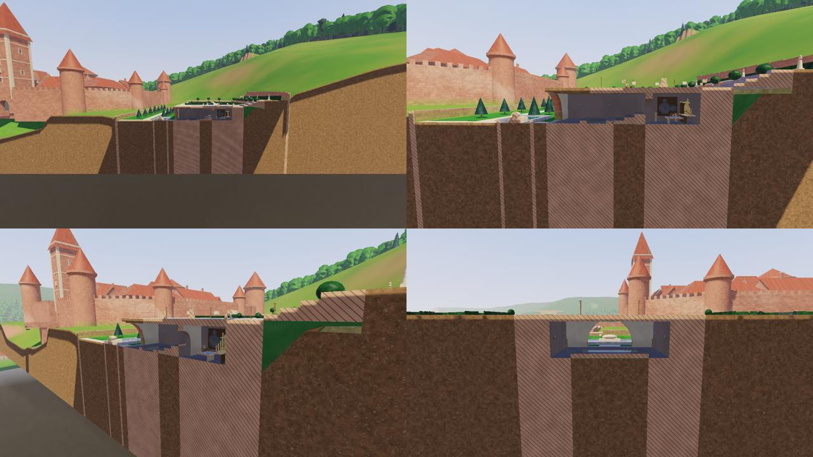

Fünf Zugaben, jede einzeln schaltbar; was aus ist, kostet nichts (Messung unten). Neuer Abschnitt **Zugaben** im Bedienfeld.

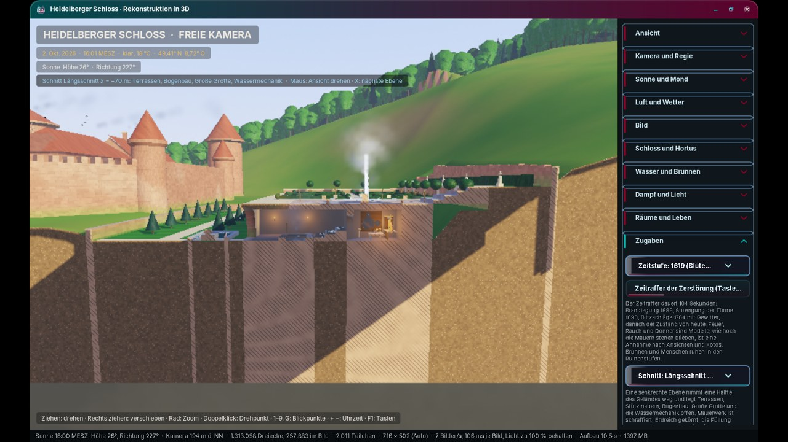

### Zeitschalter und Zeitraffer der Zerstörung

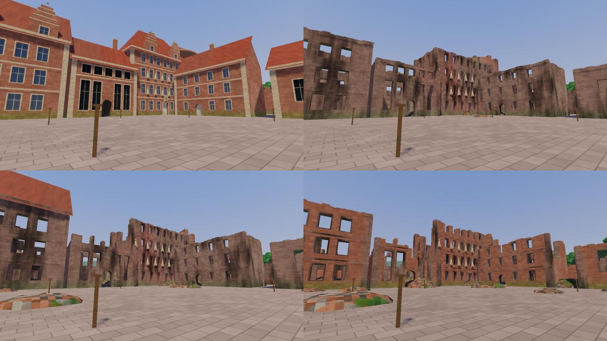

Vier Zeitstufen desselben Modells: **1619**, **nach 1689** (Brand), **nach 1693** (Sprengung), **nach 1764** (Blitz, Zustand von heute). Jedes Dreieck trägt eine Zeitmaske (`MeshBuilder.era`); `World.stageScene(s)` baut aus der Maske das Netz der Stufe, Kollisionsflächen (`stageSolids`) und Kamera folgen der Stufe. Die Ruinenstufen haben Mauerstümpfe mit gebrochenen Kronen, geschwärzten Fassaden (`Mat.SOOT`), Schutt (`Mat.RUBBLE`) und verkohltes Holz (`Mat.CHAR`); die Stadt bleibt unverändert.

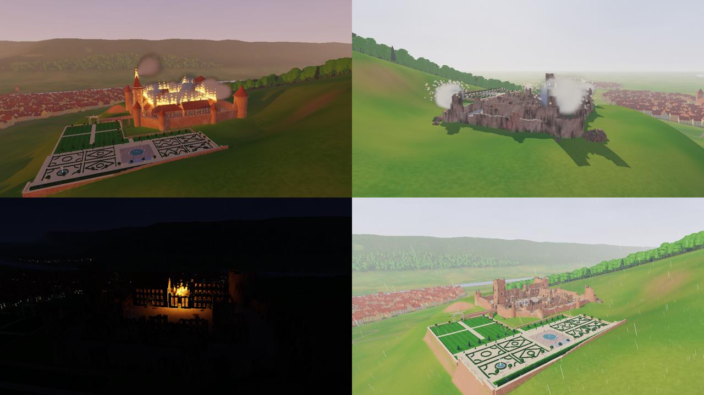

Der **Zeitraffer** (Taste Z, 104 s) fährt die Kamera selbst und zeigt: 1619 → die Brandlegung am 2. März 1689 (Feuer breitet sich entlang der Dachfirste aus, Flammen sind Leuchtflecke mit Punktlichtern, dazu Rauch) → die Sprengung am 6. September 1693 (sechs Sprengstellen an den Türmen, weißer Blitz, Schutt, Staubsäulen, Knall) → das Gewitter vom 24. Juni 1764 mit zwei Einschlägen (Saalbau, Glockenturm) und Brand → der Morgen danach und heute. Tafeln mit Quellen begleiten ihn, Esc beendet ihn, die Leertaste hält ihn an.

### Wasserweg

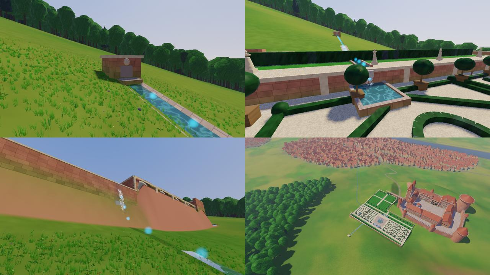

Das Wasser des Hortus hat jetzt einen Weg: Brunnenstube am Hang → offene Hangrinne → Rinne über die Obere Terrasse → Mauerfall in den Trog der Hauptterrasse → Leitungen (unterirdisch) zu Säulenbrunnen, Achteckbecken und Großer Grotte → Kaskade, Rhenusbecken → Abflussrinne → Fall über die Westmauer → Abflussbach (steilster Abstieg, 130 Knoten) zum Neckar. Schalter *Wasserweg* zeigt wandernde Perlen, die Geschwindigkeit je Abschnitt unterscheidet; die Statuszeile nennt den Abschnitt, in dem die Kamera steht. Die Fahrt **„Dem Wasser folgen“** (143 s, 1 034 m) begleitet das Wasser mit Tafeln. *Der Abflussbach fehlte seit Phase 5.*

### Wasserorgel

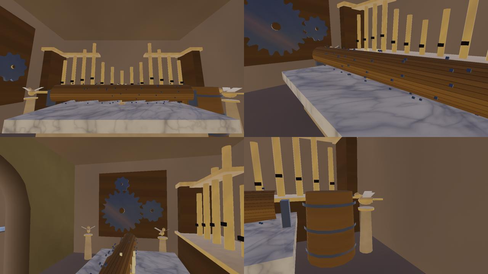

Im Raum hinter der Großen Grotte steht ein Pfeifenwerk mit 13 Prospektpfeifen, Wasserkessel, Stiftwalze (70 Stifte), drei Zahnrädern und vier Uhrwerkvögeln; Walze, Räder und Vögel sind Drehkörper des Netzes und drehen sich wirklich. Der Ton wird im Programm synthetisiert (`Klang`, `Wasserorgel.Voice`; 22,05 kHz, keine Klangdateien): Melodie in D-dorisch (eigene Komposition), Bordun, Atem, Wasserrauschen, Zahnradticken, Vogeltriller. Hörbar im Raum und leiser in der Halle davor; ohne Tonausgang bleibt das Programm stumm. Auch Knall der Sprengung und Donner sind synthetisiert.

### Schnitt durch Terrassen und Bogenbau

Eine senkrechte Ebene nimmt eine Hälfte des Geländes weg: **Längsschnitt x = −70 m** (Terrassen, Bogenbau, Große Grotte, Wassermechanik) und **Querschnitt z = 95 m** (beide Grotten). Der Renderer schneidet die Dreiecke an der Ebene (`Engine3D.clipPlane`), und die Schnittfläche füllt `core.Schnitt` aus dem Netz selbst: In Spalten von 20 cm wird ein senkrechter Strahl durch die Ebene gelegt; von jeder Fläche, die nach oben zeigt, bis zur nächsten, die nach unten zeigt, ist Masse (Mauerwerk schraffiert, Erdreich gekörnt), dazwischen bleiben Räume und Türöffnungen leer. Schattenwurf und Kollisionsflächen der weggenommenen Seite entfallen. Taste X wechselt die Ebene.

### Stein-Lupe

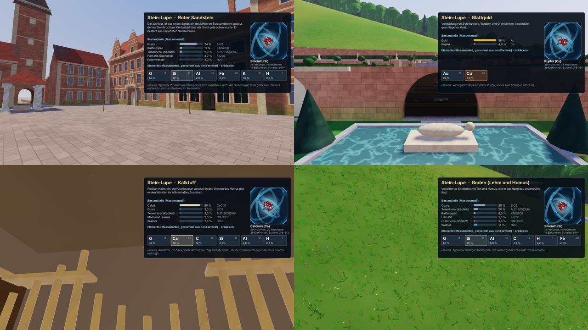

Mit Taste L (oder im Bedienfeld) wird ein Klick auf eine Fläche zu einer Untersuchung: Der Stoff (aus der Materialnummer am Bildpunkt) wird mit seinen Bestandteilen und Massenanteilen gezeigt, die Elemente daraus (aus den Formeln mit Atommassen gerechnet) als Kacheln, und zum gewählten Element das **Atommodell**: Kern aus Protonen und Neutronen, Schalen, Elektronen auf Bahnen. Der Atomzeichner ist der `AtomRenderer` aus dem Projekt ATOMMODEL (Paket `com.dan.heidelberg.lupe`, ohne Datenbank, mit einer kleinen Elementtabelle von 19 Elementen). 19 Stoffe: roter Sandstein, Kalktuff, Marmor, Boden, Kies, Pflanzen, Eichenholz, Holzkohle, Wasser, Kalkputz, Ziegel, Glas, Spiegel, Eisen, Gold, Wachs, Gewebe, berußter Sandstein und Schutt.

### Bedienung

| Taste | Wirkung |
|---|---|
| Z | Zeitraffer der Zerstörung starten und beenden |
| X | Schnitt: Ebene 1, Ebene 2, aus |
| L | Stein-Lupe an und aus |

Im Bedienfeld, Abschnitt **Zugaben**: Zeitstufe wählen, Zeitraffer starten, Schnitt wählen, Stein-Lupe, Wasserweg, Wasserorgel, Ton. Prüfhilfen: `-Dheidelberg.zeit=true`, `-Dheidelberg.stufe=0..3`, `-Dheidelberg.schnitt=1|2`, `-Dheidelberg.lupe=true`, `-Dheidelberg.wasserweg=true`.

### Gemessen

Auf dem Testrechner (2 Kerne, ohne Grafikkarte; `ZeitCheck`, `ZugabenCheck`, `CameraCheck`, `DirectorCheck`, `LifeCheck`, `KlangCheck`):

| Prüfung | Ergebnis |
|---|---|
| Zeitraffer, ganzer Ablauf (2 742 Schritte) | 0 Schritte im Körper, 0 durch Flächen, 0 unter dem Boden, kleinster Abstand zu Körpern 1,00 m; alle Zeitmarken und Blitze wie vorgesehen |
| Bildzeit im Zeitraffer (640 × 360, alle fünf Bilder) | 159 bis 192 ms je Bild, so viel wie ein Weitblick ohne Zeitraffer |
| 28 Blickpunkte, 756 Flüge dazwischen, 12 Fahrten (darunter „Dem Wasser folgen“) | keiner im Körper; 0 Verstöße; kleinster Abstand zu Körpern 0,42 m (Flüge) und 0,44 m (Fahrten) |
| Drehbuch (`DirectorCheck`), Figuren und Fuhrwerke (`LifeCheck`) | 0 Verstöße, wie vorher |
| Bildzeit, 1280 × 720, Hof / Hortus von oben / Westblick | Zugaben aus 204 / 161 / 213 ms; Wasserweg-Perlen an 197 / 167 / 227 ms; Schnitt an 112 bis 195 ms (Messrauschen ±10 %, der Schnitt ist schneller, weil Geometrie entfällt) |
| Stein-Lupe zeichnen | 5 ms je Bild, nur solange eine Karte offen ist |
| Orgelklang | 8 ms Rechenzeit je Sekunde Ton, nur in Hörweite (sonst Stille ohne Rechnung); Grundtöne D, E, F, C, kein Übersteuern |

**Bekannte Mängel und Grenzen**:
- Höhe der Mauerreste, Notdach des Ottheinrichsbaus nach 1693 und Brandverlauf sind Annahmen des Modells; Feuerausbreitung und Rauch sind ein Modell. Die Stadt ist in den Ruinenstufen unverändert, die Brunnen des Hortus trocken (Wasser in den Becken bleibt), keine Menschen.
- Die Sprengung wechselt alle Türme auf einmal unter einem weißen Blitz. Rauch und Staub sehen von nahem wie flache Scheiben aus; die Nacht 1764 ist dunkel.
- Quelle, Brunnenstube, Bleileitungen und Abflussweg des Wasserwegs sind Annahmen nach de Caus; dass die Wasserorgel (de Caus 1615, *Les raisons des forces mouvantes*) im Heidelberger Garten stand, ist ebenfalls eine Annahme. Die Melodie ist eine eigene Komposition.
- Schnitt: nur in der Zeitstufe 1619, nur zwei feste Ebenen; Gras, Wege, Laub und Teilchen der weggenommenen Seite entfallen; bei Flächen ohne Unterseite (einseitige Dächer) füllt sich die Schnittfläche bis zur Sohle durch.
- Stein-Lupe: Anteile sind typische Werte für die Stoffart, nicht am Heidelberger Stein gemessen; Quecksilber fehlt in der Elementtabelle (Spiegelbelag als Zinn vereinfacht).
- Der Ton wurde nur als Datei geprüft (Tonhöhen, Spitzenwerte), nicht über eine Soundkarte gehört.

## Phase 10: Oberfläche und Datenbank

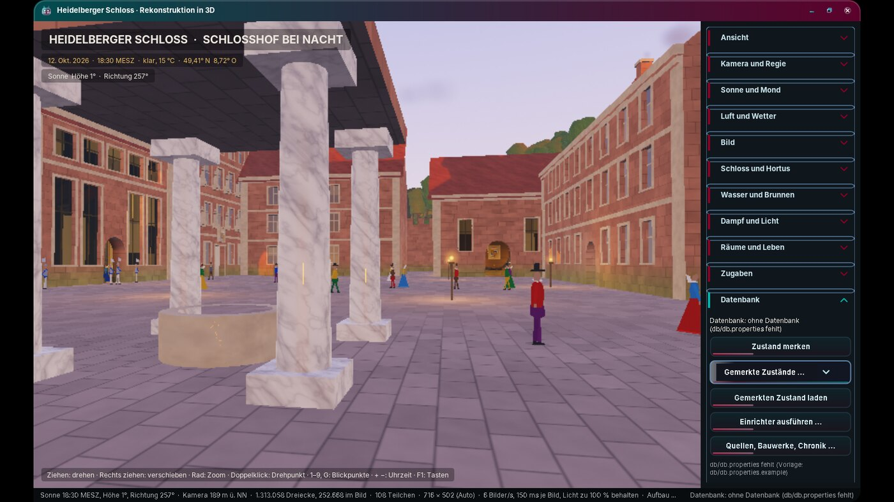

Das Programm merkt sich, wo man aufgehört hat, und kann Quellen, Blickpunkte, Fahrten und das Drehbuch aus einer Oracle-Datenbank lesen. Die Datenbank ist nie Voraussetzung: Ohne sie läuft alles mit den eingebauten Werten.

### Startbild

Beim Start zeigt ein kleines Fenster die Lage der Datenbank und den letzten Zustand („1619 · Schlosshof bei Nacht“). **Weiter, wo du aufgehört hast** stellt Zeit, Stufe, Wetter, Schalter und Kamera wieder her, **Neu beginnen** startet wie bisher. Ist alles klar, läuft ein Zähler von 6 Sekunden und das Programm macht allein weiter; jeder Tastendruck und jeder Mausklick hält ihn an. Fehlt das Passwort, fragt das Startbild danach; ist die Datenbank noch leer, bietet es **Einrichten …** an. **Ohne Datenbank starten** schaltet sie für die Sitzung ab.

### Zustand beim Beenden

Beim Schließen (und beim Beenden von außen) schreibt das Programm den Zustand: 38 Werte von Tag und Uhrzeit über Wetter, Nebel, Wind, Effekte, Leben und Zugaben bis zu Qualität, Farbstil, Zeitstufe, Schnitt, Blickpunkt und Kamera (Drehpunkt, Richtung, Neigung, Abstand). Mit Datenbank geht er nach `HEI_STATE` (die letzten 10 bleiben), ohne in `~/.heidelberg/zustand.properties`. Im Bedienfeld, Abschnitt **Datenbank**, merkt **Zustand merken** einen Zustand unter einem Namen, und ein Auswahlfeld lädt ihn wieder. Testläufe mit `-Dheidelberg.day`, `.view` und so weiter starten ohne Startbild und ohne Wiederherstellung und sichern nichts.

### Datenbank

Schema `DEMO`, Dienst `PDBORCL`, Präfix `HEI_` (wie `SEM_`). 11 Tabellen:

| Tabelle | Inhalt |
|---|---|
| `HEI_SOURCE`, `HEI_STAGE`, `HEI_CHRONIK` | 8 Quellen mit Widersprüchen, die vier Zeitstufen, 13 Ereignisse |
| `HEI_BUILDING` | 32 Bauwerke mit Detailstufe, Rolle, Lage in Metern und als `SDO_GEOMETRY` (SRID 8307, räumlicher Index) |
| `HEI_VIEW` | die 28 Blickpunkte |
| `HEI_CLIP`, `HEI_SHOT`, `HEI_PANEL` | 12 Fahrten und das Drehbuch mit 12 Szenen und 27 Tafeln samt Quelle |
| `HEI_SESSION`, `HEI_EVENT` | Protokoll: ein Lauf (Rechner, Fenster, Bilder je Sekunde, Dauer) und seine Ereignisse (Fahrt, Drehbuch, Stufe, Schnitt, Blickpunkt, Standbild, Fehler) |
| `HEI_STATE` | Zustand beim Beenden und gemerkte Zustände |

Blickpunkte, Szenenzeiten und Tafeln aus der Datenbank ersetzen beim Start die eingebauten Werte, sofern Zahl und Namen stimmen und die Zahlen plausibel sind; sonst bleiben die eingebauten. Das Protokoll schreibt auf einem eigenen Thread, die Bildschleife wartet nie auf Oracle.

### Einrichter

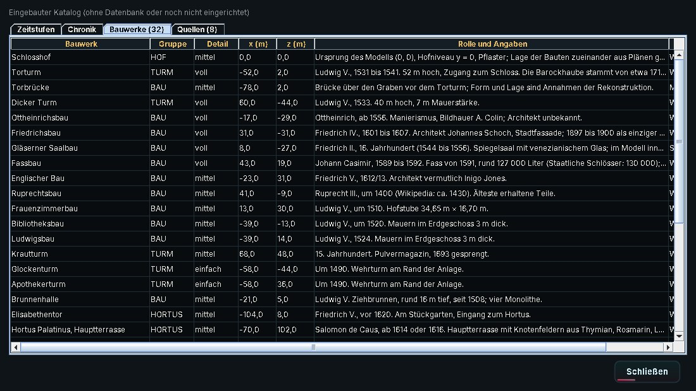

Die Skripte `db/01` bis `db/04` legen Tabellen, Folgen, Trigger, Indizes, das Paket `HEI_API` und die Grunddaten an. Der **Einrichter** (Startbild oder Bedienfeld, auch von der Konsole) nimmt zuerst den Bestand des Schemas auf (`db/bestand.txt`), führt die Skripte aus, prüft jedes Objekt auf Dasein und Gültigkeit, die Geometrie samt Index, das Paket mit einer Funktionsprobe (Sitzung, Ereignis, Beenden, Zustand, danach zurückgenommen) und die Zeilenzahlen der Grunddaten. Er endet mit `ERGEBNIS: alles in Ordnung` oder der Zahl der Probleme; das Protokoll steht in `db/einrichtung.txt`. Er legt nur Fehlendes an, verändert und löscht nichts und überschreibt keine Grunddaten, kann also beliebig oft laufen. Das Passwort steht nie in Skripten oder im Git: `db/db.properties` (nicht im Git, Vorlage `db/db.properties.example`), die Umgebungsvariable `HEIDELBERG_DB_PASSWORD` oder das Startbild. Einzelheiten in `db/README.md`.

Der Katalog (Bedienfeld, **Quellen, Bauwerke, Chronik …**) zeigt Zeitstufen, Chronik, Bauwerke mit Lage und Quellen, aus der Datenbank oder, ohne sie, die eingebauten Werte.

### Bedienung

Im Bedienfeld, Abschnitt **Datenbank**: Lage der Verbindung, Zustand merken, gemerkten Zustand laden, Einrichter, Katalog. Die Statuszeile zeigt rechts die Lage der Datenbank. Start ohne Startbild: `-Dheidelberg.splash=false`; ohne Datenbank: `-Dheidelberg.nodb=true`; Ordner der Skripte: `-Dheidelberg.db.dir=…`; Ordner für Zustand und Protokoll ohne Datenbank: `-Dheidelberg.state.dir=…`.

### Gemessen

Auf dem Testrechner, ohne Oracle (`DbCheck`, `EinrichterTest`, `SeedGen`):

| Prüfung | Ergebnis |
|---|---|
| Skripte | 4 Skripte, 195 Anweisungen; 11 Tabellen, 30 Indizes, 11 Folgen, 11 Trigger, Paket mit Rumpf; kein Bezeichner über 30 Zeichen, kein reserviertes Wort als Spalte |
| `Zustand` gegen `HEI_STATE` | 38 Spalten Zeile für Zeile gleich (Name, Typ, Vorgabe, Grenzen, Genauigkeit); 50 Zufallszustände über Datei und zurück ohne Abweichung |
| Grunddaten | 137 Anweisungen `INSERT … WHERE NOT EXISTS`; Längen aller Texte in Bytes innerhalb der Spalten; zweiter Lauf fügt nichts hinzu |
| Einrichter gegen eine Attrappe von Oracle | leeres Schema: 0 Probleme; zweiter Lauf: 0 Probleme, alles „schon vorhanden“; ungültiges Paket wird mit seinem Übersetzungsfehler gemeldet |
| Start und Beenden ohne Datenbank | Zustand geschrieben, beim nächsten Start Stufe, Zeit, Wetter, Schalter und Kamera wie gespeichert; Ereignisse in `protokoll.log` |

**Grenzen**: Die Prüfungen oben liefen auf dem Testrechner ohne Oracle; der Einrichter selbst lief danach auf dem Zielrechner gegen Oracle 21c (`PDBORCL`, Schema `DEMO`) und meldete alles in Ordnung. Das Passwort wird im Speicher gehalten, solange das Programm läuft. Der Zustand merkt kein laufendes Drehbuch und keine Fahrt, nur ihre Wirkung (Zeit, Wetter, Kamera).

## Phase 11: Schliff

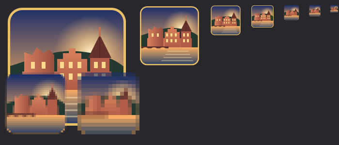

### Programmsymbol

Das Symbol ist wie alles andere gemalt (`ui/AppIcon`): das Schloss am Hang im Abendlicht, links der Dicke Turm als Ruine, in der Mitte der Ottheinrichsbau mit gestuftem Giebel, rechts der Friedrichsbau mit steilem Dach, davor der Neckar mit der Alten Brücke. Für 32 Pixel und kleiner gibt es eine grobe Fassung mit kräftigen Flächen, damit es in der Taskleiste lesbar bleibt (ohne Fenster, Spiegelung und Rand).

- Fenster, Taskleiste und Alt+Tab bekommen es von allein (`AppIcon.install`).
- `icon/heidelberg.ico` (7 Größen von 16 bis 256 Pixel) und `icon/heidelberg-256.png` erzeugt `tools/IconExport`: `java -cp "dist/Heidelberg.jar;lib/*" com.dan.heidelberg.tools.IconExport .` (im Projektordner; die Dateien liegen schon bei).
- **`Verknuepfung.bat`** (Doppelklick) legt auf dem Desktop die Verknüpfung „Heidelberg 1619“ mit dem Symbol an; sie startet `javaw -Xmx4g -jar dist\Heidelberg.jar` im Projektordner, also ohne Konsolenfenster. Gesucht wird `javaw.exe` über `JAVA_HOME`, sonst über den Pfad.

### Tempo

`-Dheidelberg.bench=true` gibt alle 240 Bilder die mittleren Zeiten der Teilschritte aus (Simulation, Aufbau mit Tabellen, Ecken, Dreiecken und Streifen, Rasterung, Licht, Nachbild mit Strahlen, Teilchen, Bloom); `-Dheidelberg.scale=0.6` hält die Bildgröße fest, damit Messungen vergleichbar sind. Mit der Flugaufzeichnung des JDK sah man, wo die Zeit liegt: Rasterung, Licht je Pixel und die Eckenumrechnung.

Zwei Änderungen, beide ohne sichtbaren Unterschied:

- **Eckenumrechnung**: 230 000 Ecken schwanken im Wind und 175 000 Blattecken zittern, je mit zwei Sinuswerten je Bild. Der Sinus kommt jetzt aus einer Tabelle mit linearer Zwischenstufe (Fehler unter 1e-6). Die Umrechnung fiel von 31,0 auf 16,5 ms.
- **Dreiecke einreihen**: ein Schnellweg für Dreiecke ganz vor der Nahebene, der die Ecken nicht erst umkopiert. Das Bild ist Bit für Bit gleich (geprüft mit `cmp`), die Zeit blieb im Rauschen.

### Farbstile und Kinomodus

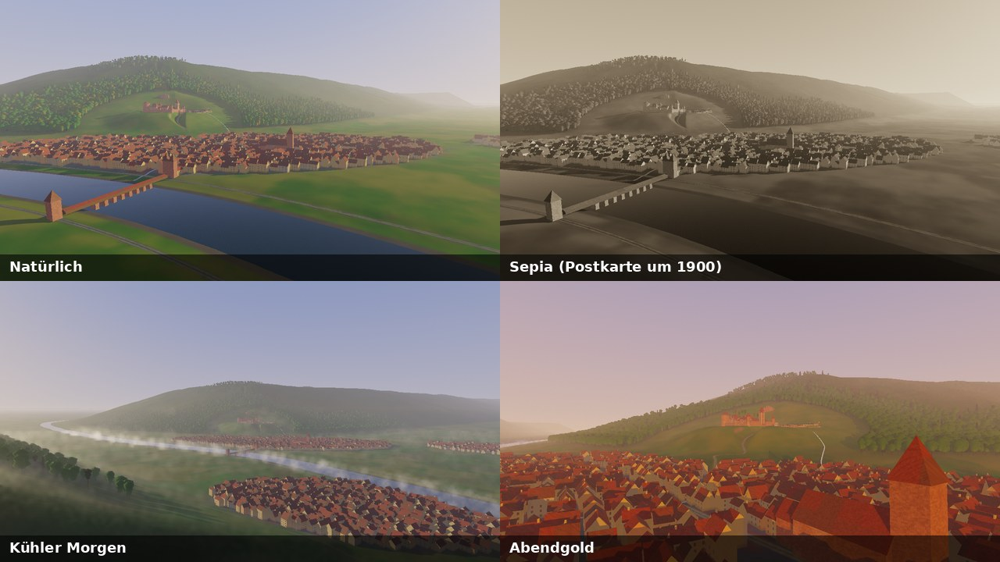

Zu den sechs Farbstilen kommen **Sepia (Postkarte um 1900)** und **Kühler Morgen** (Reihenfolge der alten Stile bleibt, gemerkte Zustände laden also weiter richtig).

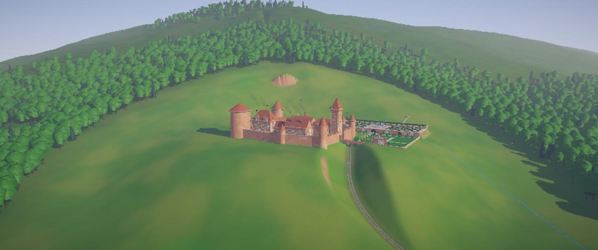

Der Kinomodus dunkelt die Ränder leicht ab (Vignette, in der Mitte unberührt, an den Ecken bis auf die Hälfte); sie kostet eine Multiplikation je Pixel und gilt nur im Kinomodus.

### Abgleich mit Karten

`tools/Abgleich` legt Lage und Höhe wichtiger Punkte neben die Angaben aus Wikipedia, Mapcarta und OpenStreetMap:

| Punkt | Lage | Höhe im Modell | Soll |
|---|---|---|---|
| Königstuhl | 1 m daneben | war 550 m, jetzt **568 m** | 567,8 m |
| Heiligenberg | Gipfel war 136 m daneben, jetzt auf der Karte | war 422 m, jetzt **440 m** | 439,9 m |
| Alte Brücke | 2 m | 104 m (Wasserspiegel 107 m) | |
| Heiliggeistkirche | 30 m | 113 m | |

Weitere Änderungen aus der Liste der offenen Punkte:

- Die **Kuppe** unter dem Schloss ist weg: Der Absatz geht jetzt über 150 statt 90 m in den Hang über; die dunklen Schatten auf der Kuppe im Morgenlicht entfallen.
- **Felsflecken**: roter Buntsandstein zeigt sich nur noch auf offenen, steilen Hängen und in Flecken, im Wald bleibt er verdeckt.
- **Altstadtdächer**: Neben den roten gibt es verwitterte braune und einzelne graue (Schiefer, Schindeln); das Schloss behält seine roten Ziegel.
- **Herbstlaub**: Buchen in Gold, Orange und Kupfer statt dunklem Rot, Eichen heller braun.

Offen bleiben der Löwe im Wappen (stilisiert) und Fackelschatten. Der „fehlende Abflussbach“ aus den alten Listen kam längst mit dem Wasserweg (Phase 9).

### Gemessen

Auf dem Testrechner (2 Kerne, ohne Grafikkarte, Fahrt „Anflug“, 716 × 502, 318 000 Dreiecke im Bild):

| Teil | vorher | nachher |
|---|---|---|
| Ecken umrechnen | 31,0 ms | 16,5 ms |
| Aufbau insgesamt | 54,5 ms | 39–40 ms |
| Bild insgesamt | 193 ms | 181–185 ms (Rauschen etwa ±5 %) |

Prüfungen: `CameraCheck` (0 Fahrten mit Verstoß, 0 Bilder im Körper), `DirectorCheck` (ganzes Drehbuch, Abbruch und Überspringen) und `ZugabenCheck` laufen nach den Geländeänderungen unverändert; das Standbild mit dem Tabellensinus weicht vom alten in 20 von 921 600 Bildpunkten ab (größte Abweichung 11 von 255).

**Grenzen**: Die Messungen stammen von einem Rechner mit zwei Kernen; wie viel der Gewinn bei dir ausmacht, zeigt die Statuszeile (Auto hielt bisher 33–37 Bilder je Sekunde). Die Verknüpfung ist auf Windows gedacht und hier nicht ausgeführt. Der Abgleich kennt nur vier Punkte, weil die übrigen Lagen (Schlossbauten, Hortus) keine veröffentlichten Koordinaten haben.

## Starten

In NetBeans: Projekt öffnen, *Clean and Build*, dann `Heidelberg.bat` (oder *Run*, Hauptklasse `com.dan.heidelberg.HeidelbergApp`). Benötigt Java 21, `lib/FStyle.jar` und `lib/ojdbc11.jar`; läuft ohne Datenbank (Einrichten siehe `db/README.md`). `Heidelberg.bat` startet aus dem Projektordner, dort liegt `db`. Der Aufbau dauert etwa 10 Sekunden (1,2 Mio. Dreiecke). Der Renderer wählt die Bildgröße selbst, um 30 Bilder je Sekunde zu halten. Eine Verknüpfung mit dem Programmsymbol legt `Verknuepfung.bat` auf den Desktop.

## Bedienung

| Taste / Maus | Wirkung |
|---|---|
| Ziehen, rechts ziehen, Rad | drehen, verschieben, Zoom |
| Doppelklick | neuer Drehpunkt |
| W A S D, Q E, Umschalt | Drehpunkt bewegen, heben, schneller |
| Leertaste | Rundflug (Orbit); im Drehbuch Pause |
| 0 oder R, 1 bis 9, G | Übersicht, Blickpunkte 1 bis 9, nächster Blickpunkt (es gibt 28, G geht durch alle) |
| + und − | Uhrzeit ± ½ Stunde |
| Y | Wetter wechseln |
| V, B, N | nächste Fahrt, Drehbuch an und aus, nächste Szene |
| P | Standbild (doppelte Größe) nach `Bilder/Heidelberg` |
| K oder F11 | Kinomodus |
| Z, X, L | Zeitraffer der Zerstörung, Schnitt (Ebene wechseln), Stein-Lupe |
| Esc | Fahrt, Drehbuch oder Zeitraffer beenden, dann Kinomodus beenden |
| F1 oder H | alle Tasten |

Schöne Zeiten für die Lichtschächte: Herbst (Tag um 285), 13 Uhr, Blickpunkt „Gläserner Saalbau innen“.

## Aufbau

```
com.dan.forest, ground, river, road   wiederverwendbare Pakete (Bäume, Böden, Wasser, Straßen)
com.dan.heidelberg.core               Renderer: Engine3D, Terrain, Materialien, Schatten, Teilchen, Solids (feste Körper), Schnitt (Schnittebene und Füllung)
com.dan.heidelberg.effects            Himmel, Sonne und Mond, Klima, Wetter, Licht, ValleyFog (Talnebel)
com.dan.heidelberg.castle             Arch (Baukasten), Castle, Heraldry (Wappen), Hortus, Fountains (Brunnen), Torches (Fackeln), Smoke (Rauch), Probe,
                                      Ruin (Ruinenstufen), Zeit (Zeitraffer), Klang (Tonsynthese), Wasserweg, Wasserorgel, Schnitte (Ebenen)
com.dan.heidelberg.lupe               Stein-Lupe: Stoffe (Stoffe und Elemente), Lupe (Karte), Atomzeichner aus ATOMMODEL
com.dan.heidelberg.world              Heidelberg, Neckar, Wald, Wiese, Wege, Altstadt
com.dan.heidelberg.camera             Orbit-Kamera mit Kollisionsschutz, Blickpunkte, Router (Flüge um Hindernisse), Rides (Fahrten), Director (Drehbuch)
com.dan.heidelberg.ui                 Szene, Bedienfeld, Symbol, Startbild, Einrichter-Dialog, Katalog-Dialog
com.dan.heidelberg.db                 Dienst (Lage, Sitzung, Protokoll, Zustand), Db, Skript, Einrichter, Katalog, KatalogDb, Zustand, ZustandDb
db/                                   Skripte 01 bis 04, Vorlage db.properties.example, README
com.dan.heidelberg.tools              StillRender (Standbilder ohne Fenster), P9Render (Standbilder der Phase 9), ZeitCheck (Zeitraffer ohne Fenster), ZugabenCheck (Kosten der Zugaben), KlangCheck (Töne als WAV), CameraCheck und DirectorCheck (Kamera), LifeCheck (Wege der Figuren), FreeMap (begehbare Fläche), WaterCheck (Höhen und Last der Brunnen), AtmoCheck (Nebel, Rauch, Bildzeiten), CameraCheck (Kamera gegen Mauern, Gelände, Bäume), DirectorCheck (ganzes Drehbuch), SeedGen (erzeugt db/04_seed.sql), DbCheck (Skripte, Zustand, Grunddaten), EinrichterTest (Einrichter gegen Attrappe), DialogShots (Dialoge als Bild), IconExport (Programmsymbol als .ico und .png), Abgleich (Lage und Höhen gegen Karten)
```

Koordinaten: x nach Osten, y nach oben, z nach Süden, Nullpunkt im Schlosshof (49,4067° N, 8,7153° O), y = 0 entspricht 187 m ü. NN.

## Gesichertes und Geschätztes

Gesichert: Höhen von Neckar, Altstadt, Königstuhl (567,8 m) und Heiligenberg (439,9 m) und der Sonnenstand sind gerechnet oder aus Karten bekannt; seit Phase 11 stimmen die Gipfel im Modell auf den Meter.

**Geschätzt** (aus Plänen und Erinnerung; der Abgleich in Phase 11 deckt nur Gipfel, Brücke und Kirche ab):
- Lage und Umriss der Schlossbauten zueinander, Geschosszahlen, Fensterraster und Dachformen (Maße in `Castle.java`, Liste `PLACES`)
- Lage des Hortus südwestlich des Schlosses, Höhen der drei Ebenen (−2,0 / 3,5 / 6,0 m) und Größen der Beete (`Hortus.java`)
- Lage, Höhen und Zahl der Brunnenstrahlen (de Caus nennt keine Strahlhöhen), Größe der Grottenbecken
- Neckarlauf, Alte Brücke, Altstadtumrisse (einige zehn Meter), Höhenlinien der Hänge, Klimawerte
- Wege: Burgweg und Königstuhlweg wurden um den Hof herumgeführt
- Nebeltage, Nebelhöhen, Fackelstandorte und Kaminhäufigkeit (Phase 6) sind Modellannahmen, keine historischen Angaben
- Phase 8: Maße des Großen Fasses, Küfer, Leiter und Wappen am Fassboden; Saal ebenerdig mit Möbeln, Spiegeln und Kronleuchtern; Kleidung, Zahl, Wege und Tageszeiten von Hofstaat, Reitern, Kutsche und Karren; Vögel und ihre Jahreszeiten
- Phase 9: Mauerhöhen der Ruinenstufen, Notdach 1693, Feuer- und Rauchmodell; Quelle, Leitungen und Wasserorgel nach de Caus als Annahme; Stoffanteile der Stein-Lupe typisch, nicht gemessen
- Phase 10: die Lage der Bauwerke in der Datenbank (Meter und Grad) stammt aus den geschätzten Lagen des Modells, nicht aus Vermessung
- Wappen (Form, Ort, Größe), Torbrücke, Standort der Rundumblicke und der Ablauf des Drehbuchs (Phase 7) sind Annahmen; der Tag im Drehbuch ist ein Modelltag

**Bildrate**: Auf deinem Rechner zeigten Status_Phase2 bis 4 etwa 33–34 Bilder je Sekunde bei 900 × 541 (Auto). Auf einem Testrechner ohne Grafikkarte (2 Kerne) braucht ein Bild im Hof 150–390 ms bei 1280 × 720; die Auto-Qualität senkt die Auflösung, um 30 Bilder je Sekunde zu halten. Ob das auf deinem Rechner gelingt, zeigt die Statuszeile.
